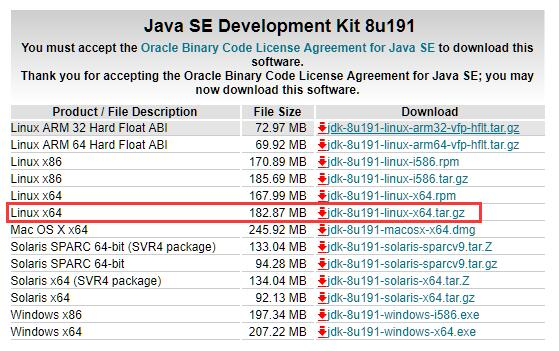
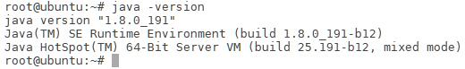

# JDK

## 下载

首先打开JDK的[下载页面](https://www.oracle.com/technetwork/java/javase/downloads/index.html)



这里我们选择的是Java SE Development Kit 8u191进行下载使用

## 安装

下载完毕后，使用下面的命令解压到相应的目录下

```
tar -zxvf ./jdk-8u191-linux-x64.tar.gz -C /opt
```

编辑.bashrc文件，将下面的文本添加进环境变量

```
#add Java environment
export JAVA_HOME=/opt/jdk1.8.0_201
export JRE_HOME=${JAVA_HOME}/jre
export CLASSPATH=.:${JAVA_HOME}/lib:${JRE_HOME}/lib
export PATH=${JAVA_HOME}/bin:$PATH
```



然后运行下面的命令，查看JDK是否安装成功
```
java -version
```

## JDK没有JRE

新版本的JDK（9,10,11,10）没有JRE，可以使用下面的命令，生成JRE模块
```
bin\jlink.exe --module-path jmods --add-modules java.desktop --output jre
```
