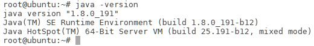

# Scala简介

Scala是一门类Java的多范式语言，它整合了面向对象编程和函数式编程的最佳特性。具体来讲：

* Scala运行于Java虚拟机（JVM）之上，并且兼容现有的Java程序，可以与Java类进行互操作，包括调用Java方法，创建Java对象，继承Java类和实现Java接口。
* Scala是一门纯粹的面向对象的语言。在Scala语言中，每个值都是对象，每个操作都是方法调用。对象的数据类型以及行为由类和特质描述。类抽象机制的扩展有两种途径，一种途径是子类继承，另一种途径是灵活的混入机制，这两种途径能避免多重继承的种种问题
* Scala也是一门函数式语言。在Scala语言中，每个函数都是一个值，并且和其他类型（如整数、字符串等）的值处于同一地位。Scala提供了轻量级的语法用以定义匿名函数，支持高阶函数，允许嵌套多层函数，并支持柯里化

# Scala安装

Scala运行在Java虚拟机（JVM）之上，因此只要安装有相应的Java虚拟机，所有的操作系统都可以运行Scala程序，包括Window、Linux、Unix、Mac OS等。

## JDK安装

### 下载

首先打开JDK的[下载页面](https://www.oracle.com/technetwork/java/javase/downloads/index.html)


这里我们选择的是Java SE Development Kit 8u191进行下载使用

### 安装

下载完毕后，使用下面的命令解压到相应的目录下

```
tar -zxvf ./jdk-8u191-linux-x64.tar.gz -C /opt
```

编辑.bashrc文件，将下面的文本添加进环境变量

```
#add Java environment
export JAVA_HOME=/opt/jdk1.8.0_201
export JRE_HOME=${JAVA_HOME}/jre
export CLASSPATH=.:${JAVA_HOME}/lib:${JRE_HOME}/lib
export PATH=${JAVA_HOME}/bin:$PATH
```



然后运行下面的命令，查看JDK是否安装成功
```
java -version
```

### JDK没有JRE

新版本的JDK（9,10,11,10）没有JRE，可以使用下面的命令，生成JRE模块
```
bin\jlink.exe --module-path jmods --add-modules java.desktop --output jre
```

## Scala安装

### 下载

https://www.scala-lang.org/download/2.11.12.html

下载2.11版本的scala

### 安装

#### win

双击下一步下一步下一步下一步下一步完成

#### linux

解压到`/opt`目录下，配置好环境变量即可

```
# SCALA
export SCALA_HOME=/opt/scala-2.12.9
export PATH=${SCALA_HOME}/bin:$PATH
```

# Scala基础

## 基础数据类型和变量

### 基础数据类型

Scala的数据类型包括：Byte、Char、Short、Int、Long、Float、Double和Boolean（注意首字母大写）

和Java不同的是，在Scala中，这些类型都是“类”，并且都是包scala的成员，比如，Int的全名是scala.Int。对于字符串，Scala用java.lang.String类来表示字符串

| 值类型  | 范围                                                         |
| ------- | ------------------------------------------------------------ |
| Byte    | 8位有符号补码整数。数值区间为 -128 到 127 （-$$2^{7}$$~$$2^{7}-1$$） |
| Short   | 16位有符号补码整数。数值区间为 -32768 到 32767（-$$2^{15}$$~$$2^{15}-1$$） |
| Int     | 32位有符号补码整数。数值区间为（-$$2^{31}$$~$$2^{31}-1$$）   |
| Long    | 64位有符号补码整数。数值区间为（-$$2^{63}$$~$$2^{63}-1$$）   |
| Float   | 32 位, IEEE 754 标准的单精度浮点数                           |
| Double  | 64 位 IEEE 754 标准的双精度浮点数                            |
| Char    | 16位无符号Unicode字符, 区间值为 U+0000 到 U+FFFF（0~$$2^{16}-1$$） |
| String  | 字符序列                                                     |
| Boolean | true或false                                                  |

### 字面量

```scala
val i = 123            //123就是整数字面量
val i = 3.14           //3.14就是浮点数字面量
val i = true           //true就是布尔型字面量
val i = 'A'            //'A'就是字符字面量
val i = “Hello”        //“Hello”就是字符串字面量
```

### 操作符

算术运算符：加(+)、减(-) 、乘(*) 、除(/) 、余数(%)；

关系运算符：大于(>)、小于(<)、等于(==)、不等于(!=)、大于等于(>=)、小于等于(<=)

逻辑运算符：逻辑与(&&)、逻辑或(||)、逻辑非(!)；

位运算符：按位与(&)、按位或(|)、按位异或(^)、按位取反(~)

赋值运算符：=及其与其它运算符结合的扩展赋值运算符，例如+=、%=

操作符优先级：算术运算符 > 关系运算符 > 逻辑运算符 > 赋值运算符

在Scala中，操作符就是方法

例如，5 + 3和(5).+(3)是等价的

```scala
scala> val sum1 = 5 + 3         //实际上调用了 (5).+(3)
sum1: Int = 8
scala> val sum2 = (5).+(3)     //可以发现，写成方法调用的形式，和上面得到相同的结果
sum2: Int = 8
```

#### 富包装类

对于基本数据类型，除了以上提到的各种操作符外，Scala还提供了许多常用运算的方法，只是这些方法不是在基本类里面定义，而是被封装到一个对应的富包装类中

每个基本类型都有一个对应的富包装类，例如Int有一个RichInt类、String有一个RichString类，这些类位于包scala.runtime中

当对一个基本数据类型的对象调用其富包装类提供的方法，Scala会自动通过隐式转换将该对象转换为对应的富包装类型，然后再调用相应的方法。例如：`3 max 5`

### 变量

Scala有两种类型的变量：

* val：是不可变的，在声明时就必须被初始化，而且初始化以后就不能再赋值

* var：是可变的，声明的时候需要进行初始化，初始化以后还可以再次对其赋值

基本语法：

val  变量名:数据类型 = 初始值

var  变量名:数据类型 = 初始值

类型推断机制（type inference）：根据初始值自动推断变量的类型，使得定义变量时可以省略具体的数据类型及其前面的冒号

```scala
scala> val myStr = "Hello World!"
myStr: String = Hello World!
```

当然，我们也可以显式声明变量的类型：

```scala
scala> val myStr2 : String = "Hello World!"
myStr2: String = Hello World!
scala> println(myStr)
Hello World!
```

myStr是val变量，因此，一旦初始化以后，就不能再次赋值

```scala
scala> myStr = "Hello Scala!"
<console>:27: error: reassignment to val
          myStr = "Hello Scala!"
                ^
```

var变量初始化以后，可以再次赋值

```scala
scala> var myPrice : Double = 9.9
myPrice: Double = 9.9

scala> myPrice = 10.6
myPrice: Double = 10.6
```

注意：在REPL环境下，可以重复使用同一个变量名来定义变量，而且变量前的修饰符和其类型都可以不一致，REPL会以最新的一个定义为准

```scala
scala> val a = "Xiamen University"
a: String = Xiamen University
scala> var a = 50
a: Int = 50
```

## 输入输出

### 控制台输入输出语句

从控制台读入数据方法：readInt、readDouble、readByte、readShort、readFloat、readLong、readChar readBoolean及readLine，分别对应9种基本数据类型，其中前8种方法没有参数，readLine可以不提供参数，也可以带一个字符串参数的提示

所有这些函数都属于对象scala.io.StdIn的方法，使用前必须导入，或者直接用全称进行调用

从控制台读入数据方法

```scala
scala> import io.StdIn._
import io.StdIn._
scala> var i=readInt()
54
i: Int = 54
scala> var f=readFloat
1.618
f: Float = 1.618
scala> var b=readBoolean
true
b: Boolean = true
scala> var str=readLine("please input your name:")
please input your name:Li Lei
str: String = Li Lei
```

向控制台输出信息方法：

* print()和println()，可以直接输出字符串或者其它数据类型，其中println在末尾自动换行。

```scala
scala> val i=345
i: Int = 345
scala> print("i=");print(i) 
//两条语句位于同一行，不能省略中间的分号
i=345
scala> println("hello");println("world")
hello
world
```

* C语言风格格式化字符串的printf()函数

```scala
scala> val i = 34
i: Int = 34
scala> val f=56.5
f: Double = 56.5
scala> printf("I am %d years old and weight %.1f Kg.","Li Lie",i,f)
I am 34 years old and weight 56.5 Kg.
```

print()、println()和printf() 都在对象Predef中定义，该对象默认情况下被所有Scala程序引用，因此可以直接使用Predef对象提供的方法，而无需使用scala.Predef.的形式。

s字符串和f字符串：Scala提供的字符串插值机制，以方便在字符串字面量中直接嵌入变量的值。

基本语法：s " …$变量名… " 或 f" …$变量名%格式化字符…"

```scala
scala> val i=10
i: Int = 10
scala> val f=3.5
f: Double = 3.5452
scala> val s="hello"
s: String = hello
scala> println(s"$s:i=$i,f=$f")    //s插值字符串
hello:i=10,f=3.5452
scala> println(f"$s:i=$i%-4d,f=$f%.1f")   //f插值字符串
hello:i=10  ,f=3.5
```

### 读写文件

#### 写入文件

Scala需要使用java.io.PrintWriter实现把数据写入到文件，PrintWriter类提供了print和println两个写方法

```scala
scala> import java.io.PrintWriter
scala> val outputFile = new PrintWriter("test.txt")
scala> outputFile.println("Hello World")
scala> outputFile.print("Spark is good")
scala> outputFile.close()
```

PrintWriter里路径可以是直接路径，也可以是相对路径

#### 读取文件

可以使用scala.io.Source的getLines方法实现对文件中所有行的读取

```scala
import scala.io.Source

val file = new PrintWriter("output.txt")
val lines = file.getLines()
for (line <- lines) println(line)
```

## 控制结构

### if条件表达式

基本语法

```scala
if (表达式) {
	语句块1
} else {
	语句块2
}
```

```
val x = 6
if (x > 0) {
  println("This is a positive number")
} else {
  println("This is not a positive number")
}
```

```scala
val x = 3
if (x > 0) {
  println("This is a positive number")
} else if (x == 0) {
  println("This is a zero")
} else {
  println("This is a negative number")
}
```

有一点与Java不同的是，Scala中的if表达式的值可以赋值给变量

```scala
val x = 6
val a = if (x > 0) 1 else -1
```

相当于c或Java里的三元操作符：

```java
x > 0 ? 1: -1
```

### while循环

基本语法

```scala
while (表达式){
		循环体
}
```

```scala
do{
		循环体
}while (表达式)
```

```scala
var i = 9
while (i > 0) {
  i -= 1
  printf("i is %d\n", i)
}
```

```scala
var i = 0
do {
  i += 1
  println(i)
} while (i < 5)
```

### for循环

基本语法 

```scala
for (变量 <- 表达式) {语句块}
```

其中，“变量<-表达式”被称为“生成器（generator）”

```scala
for (i <- 1 to 5) println(i)
1
2
3
4
5
```

```scala
for (i <- 1 to 5 by 2) println(i)
1
3
5
```

“守卫(guard)”的表达式：过滤出一些满足条件的结果。基本语法：

```scala
for (变量 <- 表达式 if 条件表达式) 语句块
```

```scala
for (i <- 1 to 5 if i % 2 == 0) println(i)
2
4
```

Scala也支持“多个生成器”的情形，可以用分号把它们隔开，比如：

```scala
for (i <- 1 to 2; j <- 1 to 5) println(f"$i,$j")
1,1
1,2
1,3
1,4
1,5
2,1
2,2
2,3
2,4
2,5
```

for推导式：for结构可以在每次执行的时候创造一个值，然后将包含了所有产生值的集合作为for循环表达式的结果返回，集合的类型由生成器中的集合类型确定

```
for (变量 <- 表达式) yield {语句块}
```

```scala
scala> val r=for (i <- Array(1,2,3,4,5) if i%2==0) yield { println(i); i}
2
4
r: Array[Int] = Array(2,4)
```

### 异常处理

Scala不支持Java中的“受检查异常”(checked exception)，将所有异常都当作“不受检异常”（或称为运行时异常）

Scala仍使用try-catch结构来捕获异常

```scala
import java.io.FileReader 
import java.io.FileNotFoundException 
import java.io.IOException 
try { 
  val f = new FileReader("input.txt") 
	// 文件操作 
} catch { 
  case ex: FileNotFoundException => 
	// 文件不存在时的操作 
  case ex: IOException => 
   // 发生I/O错误时的操作
} finally { 
  file.close() // 确保关闭文件 
} 
```

受检查异常和不受检查异常的区别：https://www.cnblogs.com/tjudzj/p/7053980.html

异常，开发者之间一直存在着争议，毕竟两类异常都各有优缺点。受检异常的特点在于它强制要求开发人员在代码中进行显式的声明和捕获，否则就会产生编译错误。这种限制从好的方面来说，可以防止开发人员意外地忽略某些出错的情况，因为编译器不允许出现未被处理的受检异常；从不好的方面来说，受检异常对程序中的设计提出了更高的要求。不恰当地使用受检异常，会使代码中充斥着大量没有实际作用、只是为了通过编译而添加的代码。而非受检异常的特点是，如果不捕获异常，不会产生编译错误，异常会在运行时刻才被抛出。

非受检异常的好处是可以去掉一些不需要的异常处理代码，而不好之处是开发人员可能忽略某些应该处理的异常。一个典型的例子是把字符串转换成数字时会发生java.lang.NumberFormatException异常，忽略该异常可能导致一个错误的输入就造成整个程序退出。

目前的主流意见是，最好优先使用非受检异常。

### 对循环的控制

为了提前终止整个循环或者跳到下一个循环，Scala没有break和continue关键字

Scala提供了一个Breaks类（位于包scala.util.control）。Breaks类有两个方法用于对循环结构进行控制，即breakable和break

```scala
breakable{
...
if(...) break
...
}
```

```scala
import util.control.Breaks._ //导入Breaks类的所有方法
val array = Array(1,3,10,5,4)
breakable{
for(i<- array){
	   if(i>5) break //跳出breakable，终止for循环，相当于Java中的break
println(i)
	}
}
// 上面的for语句将输出1，3
 
for(i<- array){
	breakable{
		if(i>5) break 
        //跳出breakable，终止当次循环，相当于Java的continue		println(i)
	}
}// 上面的for语句将输出1，3，5，4
```

## 数据结构

### 数组（Array）

数组：一种可变的、可索引的、元素具有相同类型的数据集合

Scala提供了参数化类型的通用数组类Array[T]，其中T可以是任意的Scala类型，可以通过显式指定类型或者通过隐式推断来实例化一个数组

声明一个字符串数组

```scala
val myStrArr = new Array[String](3) //声明一个长度为3的字符串数组，每个数组元素初始化为null

myStrArr(0) = "BigData"
myStrArr(1) = "Hadoop"
myStrArr(2) = "Spark"
for (i <- 0 to 2) println(myStrArr(i))
```

可以不给出数组类型，Scala会自动根据提供的初始化数据来推断出数组的类型

```scala
val intValueArr = Array(12,45,33)
val myStrArr = Array("BigData","Hadoop","Spark")
```

多维数组的创建：调用Array的ofDim方法

```scala
val  myMatrix = Array.ofDim[Int](3,4)  //类型实际就是Array[Array[Int]]
val  myCube = Array.ofDim[String](3,2,4)  //类型实际是Array[Array[Array[Int]]]
```

可以使用多级圆括号来访问多维数组的元素，例如myMatrix(0)(1)返回第一行第二列的元素

### 元组（Tuple）

元组是对多个不同类型对象的一种简单封装。定义元组最简单的方法就是把多个元素用逗号分开并用圆括号包围起来。

使用下划线“_”加上从1开始的索引值，来访问元组的元素

```scala
scala> val tuple = ("BigData",1,23.0)
scala> print(tuple._1)
"BigData"
scala> print(tuple._2)
1
scala> print(tuple._3)
23.0
```

### 容器（Collection）

Scala提供了一套丰富的容器（collection）库，包括序列（Sequence）、集合（Set）、映射（Map）等
Scala用了三个包来组织容器类，分别是scala.collection 、scala.collection.mutable和scala.collection.immutable
scala.collection封装了可变容器和不可变容器的超类或特质，定义了可变容器和不可变容器的一些通用操作


所有容器的根为Traverable特质，表示可遍历的，它为所有的容器类定义了抽象的foreach方法，该方法用于对容器元素进行遍历操作。混入Traverable特质的容器类必须给出foreach方法的具体实现。Traverable的下一级为Iterable特质，表示元素可一个个地依次迭代，该特质定义了一个抽象的iterator方法，混入该特质的容器必须实现iterator方法，返回一个迭代器（Iterator），另外，Iterable特质还给出了其从Traverable继承的foreach方法的一个默认实现，即通过迭代器进行遍历。

在Iterable下的继承层次包括三个特质，分别是序列（Seq）、映射（Map）和 集合（Set），这三种容器最大的区别是其元素的索引方式，序列是按照从0开始的整数进行索引的，映射是按照键值进行索引的，而集合是没有索引的。

### 序列（Sequence）

序列（Sequence）: 元素可以按照特定的顺序访问的容器。序列中每个元素均带有一个从0开始计数的固定索引位置

序列容器的根是collection.Seq特质。其具有两个子特质 LinearSeq和IndexedSeq。LinearSeq序列具有高效的 head 和 tail 操作，而IndexedSeq序列具有高效的随机存储操作

实现了特质LinearSeq的常用序列有列表（List）和队列（Queue）。实现了特质IndexedSeq的常用序列有可变数组（ArrayBuffer）和向量（Vector）

#### 列表(List)

列表: 一种共享相同类型的不可变的对象序列。定义在scala.collection.immutable包中

不同于Java的java.util.List，scala的List一旦被定义，其值就不能改变，因此声明List时必须初始化

```scala
var strList=List("BigData","Hadoop","Spark")
```

列表有头部和尾部的概念，可以分别使用head和tail方法来获取

head返回的是列表第一个元素的值

tail返回的是除第一个元素外的其它值构成的新列表，这体现出列表具有递归的链表结构

strList.head将返回字符串”BigData”，strList.tail返回List ("Hadoop","Spark")

不能用new来建立List（原型：**sealed abstract class List[+A]** ）

补充相同类型：对于包括List在内的所有容器类型，如果没有显式指定元素类型，Scala会自动选择所有初始值的最近公共类型来作为元素的类型。因为Scala的所有对象都来自共同的根Any，因此，原则上容器内可以容纳任意不同类型的成员。例如：val x=List(1,3.4,"Spark")

构造列表常用的方法是通过在已有列表前端增加元素，使用的操作符为`::`，例如：

```scala
val otherList="Apache"::strList
```

执行该语句后strList保持不变，而otherList将成为一个新的列表：

```scala
List("Apache","BigData","Hadoop","Spark")
```

Scala还定义了一个空列表对象Nil，借助Nil，可以将多个元素用操作符`::`串起来初始化一个列表

```scala
val intList = 1::2::3::Nil
```

与

```scala
val intList = List(1,2,3)
```

等效

注意：除了head、tail操作是常数时间O(1)，其它按索引访问的操作都需要从头开始遍历，因此是线性时间复杂度O(N)。

`::`是向右结合的（`:`结尾的操作符都是向右结合）

#### 向量(Vector)

Vetor可以实现所有访问操作都是常数时间。

```scala
scala> val vec1=Vector(1,2)
vec1: scala.collection.immutable.Vector[Int] = Vector(1, 2, 3)
scala> val vec2 = 3 +: 4 +: vec1
vec2: scala.collection.immutable.Vector[Int] = Vector(3, 4, 1, 2)
scala> val vec3 = vec2 :+ 5
vec3: scala.collection.immutable.Vector[Int] = Vector(3, 4, 1, 2, 5)
scala> vec3(3)
res6: Int = 2
```

`+:`和`:+`是Seq的方法，执行后vector本身没变

#### Range

Range类：一种特殊的、带索引的不可变数字等差序列。其包含的值为从给定起点按一定步长增长(减小)到指定终点的所有数值

Range可以支持创建不同数据类型的数值序列，包括Int、Long、Float、Double、Char、BigInt和BigDecimal等

- 创建一个从1到5的数值序列，包含区间终点5，步长为1

```scala
scala> val r=new Range(1,5,1)
scala> 1 to 5
scala> 1.to(5)
```

- 创建一个从1到5的数值序列，不包含区间终点5，步长为1

```scala
scala> 1 until 5
```

* 创建一个从1到10的数值序列，包含区间终点10，步长为2

```scala
scala> 1 to 10 by 2
```

* 创建一个Float类型的数值序列，从0.5f到5.9f，步长为0.8f

```scala
scala> 0.5f to 5.9f by 0.8f
```

`1to 10 by 2`等效于`1.to(10).by(2)`，调用了Range的by方法

### 集合（Set）

集合(set)：不重复元素的容器（collection）

列表（List）中的元素是按照插入的先后顺序来组织的，但是，“集合”中的元素并不会记录元素的插入顺序，而是以“哈希”方法对元素的值进行组织，所以，它允许你快速地找到某个元素

集合包括**可变集**和**不可变集**，分别位于`scala.collection.mutable`包和`scala.collection.immutable`包，缺省情况下创建的是不可变集

```scala
var mySet = Set("Hadoop","Spark")
mySet += "Scala"
```

如果要声明一个可变集，则需要提前引入scala.collection.mutable.Set

```scala
import scala.collection.mutable.Set
val myMutableSet = Set("Database","BigData")
myMutableSet += "Cloud Computing" 
```

### 映射（Map）

映射(Map)：一系列键值对的容器。键是唯一的，但值不一定是唯一的。可以根据键来对值进行快速的检索

Scala 的映射包含了可变的和不可变的两种版本，分别定义在包scala.collection.mutable 和scala.collection.immutable 里。默认情况下，Scala中使用不可变的映射。如果想使用可变映射，必须明确地导入scala.collection.mutable.Map

其中，操作符”->”是定义二元组的简写方式，它会返回一个包含调用者和传入参数的二元组

```scala
val university = Map("XMU" -> "Xiamen University", "THU" -> "Tsinghua University","PKU"->"Peking University")
```

如果要获取映射中的值，可以通过键来获取

```scala
println(university("XMU"))
```

对于这种访问方式，如果给定的键不存在，则会抛出异常，为此，访问前可以先调用contains方法确定键是否存在

```scala
val xmu = if (university.contains("XMU")) university("XMU") else 0 println(xmu)
```

#### 可变的映射

```scala
import scala.collection.mutable.Map
val university2 = Map("XMU" -> "Xiamen University", "THU" -> "Tsinghua University","PKU"->"Peking University")
university2("XMU") = "Ximan University" //更新已有元素的值
university2("FZU") = "Fuzhou University" //添加新元素
```

也可以使用+=操作来添加新的元素

```scala
university2 + = ("TJU"->"Tianjin University") //添加一个新元素
university2 + = ("SDU"->"Shandong University","WHU"->"Wuhan University") //同时添加两个新元素
```

### 迭代器（Iterator）

迭代器（Iterator）不是一个容器，而是提供了按顺序访问容器元素的数据结构

迭代器包含两个基本操作：next和hasNext。next可以返回迭代器的下一个元素，hasNext用于检测是否还有下一个元素

```scala
val iter = Iterator("Hadoop","Spark","Scala")
while (iter.hasNext) {
    println(iter.next())
}
```

建议：除next和hasnext方法外，在对一个迭代器调用了某个方法后，不要再次使用该迭代器

1、尽管构造一个迭代器与构造一个容器很类似，但迭代器并不是一个容器类，因为不能随机访问迭代器的元素，而只能按从前往后的顺序依次访问其元素。

2、实际上，迭代器的大部分方法都会改变迭代器的状态，例如，调用length方法会返回迭代器元素的个数，但是，调用结束后，迭代器已经没有元素了，再次进行相关操作会报错。

# 面向对象编程基础

作为一个运行一个JVM上的语言，Scala毫无疑问首先是面向对象的语言。尽管在具体的数据处理部分，函数式编程在Scala中已成为首选方案，但在上层的架构组织上，仍然需要采用面向对象的模型，这对于大型的应用程序尤其必不可少。

## 类

### 类的定义

```scala
class Counter{
       //这里定义类的字段和方法
}
```

字段定义：用val或var关键字进行定义

方法定义：

```scala
def 方法名(参数列表):返回结果类型={方法体}
```

```scala
class Counter {
  var value = 0
  def increment(step:Int):Unit = { value += step}
  def current():Int = {value}
}
```

使用new关键字创建一个类的实例

```scala
val myCounter = new Counter
myCounter.value = 5 //访问字段
myCounter. increment(3) //调用方法
println(myCounter.current) //调用无参数方法时，可以省略方法名后的括号
```

### 类成员的可见性

Scala类中所有成员的默认可见性为公有，任何作用域内都能直接访问公有成员

除了默认的公有可见性，Scala也提供`private`和`protected`，其中，private成员只对本类型和嵌套类型可见；`protected`成员对本类型和其继承类型都可见

为了避免直接暴露public字段，建议将字段设置为`private`，对于`private`字段，Scala采用类似Java中的`getter`和`setter`方法，定义了两个成对的方法`value`和`value_=`进行读取和修改

```scala
class Counter() {
  var privateValue = 0

  def value = privateValue

  def value_=(newValue: Int) = {
    if (newValue > 0) {
      privateValue = newValue
    }
  }

  def increment(step: Int) = {
    value += step
  }

  def current = value
}
```

```scala
scala> val myCounter = new Counter
myCounter: Counter = Counter@f591271
scala> myCounter.value_=(3) //为privateValue设置新的值
scala> println(myCounter.value)//访问privateValue的当前值
3
```

Scala语法中有如下规范，当编译器看到以`value`和`value_=`这种成对形式出现的方法时，它允许用户去掉下划线_，而采用类似赋值表达式的形式

```scala
myCounter.value= 3 // 等效于myCounter.value_=(3)
```

如果class Counter{}中，使用 private var value =0，那么，使用scalac命令编译该程序，会出现myCounter.value=3变量无法访问的错误，因为是私有变量，不能从外部访问。

### 方法的定义方式

基本语法：

```scala
def 方法名(参数列表):返回结果类型={方法体}
```

* 方法参数前不能加上val或var，所有的方法参数都是不可变类型
* 无参数的方法定义时可以省略括号，这时调用时也不能带有括号；如果定义时带有括号，则调用时可以带括号，也可以不带括号
* 方法名后面的圆括号()可以用大括号{}来代替
* 如果方法只有一个参数，可以省略点号（.）而采用中缀操作符调用方法
* 如果方法体只有一条语句，可以省略方法体两边的大括号

```
class Counter() {
  var value = 0

  def increment(step: Int):Unit = {
    value += step
  }

  def current:Int = value

  def getValue():Int = value
}
```

```scala
scala> val c=new Counter
c: Counter = Counter@30ab4b0e
scala> c increment 5 //中缀调用法
scala> c.getValue()     //getValue定义中有括号，可以带括号调用
res0: Int = 0
scala> c.getValue // getValue定义中有括号，也可不带括号调用
res1: Int = 0
scala> c.current() // current定义中没有括号，不可带括号调用
<console>:13: error: Int does not take parameters
       c.current()
                ^
scala> c.current  // current定义中没有括号，只能不带括号调用
res3: Int = 0
```

* 当方法的返回结果类型可以从最后的表达式推断出时，可以省略结果类型
* 如果方法返回类型为Unit，可以同时省略返回结果类型和等号，但不能省略大括号

```scala
class Counter {
    var value = 0
    def increment(step:Int) { value += step }//赋值表达式的值为Unit类型
    def current()= value //根据value的类型自动推断出返回类型为Int型
}
```

### 构造器

Scala类的定义主体就是类的构造器，称为主构造器。在类名之后用圆括号列出主构造器的参数列表

主构造器的参数前可以使用val或var关键字，Scala内部将自动为这些参数创建私有字段，并提供对应的访问方法

```scala
scala> class Counter(var name:String) //定义一个带字符串参数的简单类
defined class Counter
scala> var mycounter = new Counter("Runner")
mycounter: Counter = Counter@17fcc4f7
scala> println(mycounter.name) //调用读方法
Runner
scala> mycounter.name_=("Timer") //调用写方法
scala> mycounter.name = "Timer"// 更直观地调用写方法，和上句等效
mycounter.name: String = Timer
```

 如果不希望将构造器参数成为类的字段，只需要省略关键字var或者val

* Scala类可以包含零个或多个辅助构造器（auxiliary constructor）。辅助构造器使用this进行定义，this的返回类型为Unit

* 每个辅助构造器的第一个表达式必须是调用一个此前已经定义的辅助构造器或主构造器，调用的形式为“this(参数列表)”

```scala
class Counter {
    private var value = 0 
    private var name = ""
    private var step = 1 //计算器的默认递进步长
    println("the main constructor")
    def this(name: String){ //第一个辅助构造器
        this() //调用主构造器
        this.name = name
        printf("the first auxiliary constructor,name:%s\n",name)
    }
    def this (name: String,step: Int){ //第二个辅助构造器
        this(name) //调用前一个辅助构造器
        this.step = step
       printf("the second auxiliary constructor,name:%s,step:%d\n",name,step)
    }
    def increment(step: Int): Unit = { value += step}
    def current(): Int = {value}
}
```

```scala
scala> val c1=new Counter
the main constructor
c1: Counter = Counter@319c6b2
 
scala> val c2=new Counter("the 2nd Counter")
the main constructor
the first auxiliary constructor,name:the 2nd Counter
c2: Counter = Counter@4ed6c602
 
scala> val c3=new Counter("the 3rd Counter",2)
the main constructor
the first auxiliary constructor,name:the 3rd Counter
the second auxiliary constructor,name:the 3rd Counter,step:2
c3: Counter = Counter@64fab83b
```

##  对象

### 单例对象

Scala采用单例对象（singleton object）来实现与Java静态成员同样的功能

使用object 关键字定义单例对象

```scala
object Person {
    private var lastId = 0  //一个人的身份编号
    def newPersonId() = {
        lastId +=1
        lastId
    }
}
```

单例对象的使用与一个普通的类实例一样：

```scala
scala> printf("The first person id: %d.\n",Person.newPersonId())
The first person id: 1.
scala> printf("The second person id：%d.\n",Person.newPersonId())
The second person id：2.
scala> printf("The third person id: %d.\n",Person.newPersonId())
The third person id: 3.
```

#### 伴生对象和孤立对象

* 当一个单例对象和它的同名类一起出现时，这时的单例对象被称为这个同名类的“伴生对象”（companion object）。相应的类被称为这个单例对象的“伴生类”

* 类和它的伴生对象必须存在于同一个文件中，可以相互访问私有成员

* 没有同名类的单例对象，被称为孤立对象（standalone object）。一般情况下，Scala程序的入口点main方法就是定义在一个孤立对象里

```scala
class Person(val name:String){
    private val id = Person.newPersonId() //调用了伴生对象中的方法
    def info() {
        printf("The id of %s is %d.\n",name,id)
    }
}
object Person {
    private var lastId = 0  //一个人的身份编号
    def newPersonId() = {
        lastId +=1
        lastId
    }
    def main(args: Array[String]) {
        val person1 = new Person("Lilei")
        val person2 = new Person("Hanmei")
        person1.info()
        person2.info()
    }
}
```

```scala
The id of Lilei is 1.
The id of Hanmei is 2.
```

### apply方法

思考下行代码的执行过程：

```scala
val myStrArr = Array("BigData","Hadoop","Spark")
```

* Scala自动调用Array类的伴生对象Array中的一个称为apply的方法，来创建一个Array对象myStrArr
* apply方法调用约定：用括号传递给类实例或单例对象名一个或多个参数时，Scala 会在相应的类或对象中查找方法名为apply且参数列表与传入的参数一致的方法，并用传入的参数来调用该apply方法

```scala
class TestApplyClass {
    def apply(param: String){
	     println("apply method called: " + param)
	}
}
```

```scala
scala> val myObject = new TestApplyClass
myObject: TestApplyClass = TestApplyClass@11b352e9
scala> myObject("Hello Apply")// 自动调用类中定义的apply方法，等同于下句
apply method called: Hello Apply
scala> myObject.apply("Hello Apply")  //手动调用apply方法
apply method called: Hello Apply
```

伴生对象中的apply方法：将所有类的构造方法以apply方法的形式定义在伴生对象中，这样伴生对象就像生成类实例的工厂，而这些apply方法也被称为工厂方法

```scala
class Car(name: String) {
    def info() {
        println("Car name is "+ name)
    }
}
object Car {
    def apply(name: String) = new Car(name) //调用伴生类Car的构造方法
}
object MyTestApply{
    def main (args: Array[String]) {
    val mycar = Car("BMW") //调用伴生对象中的apply方法
    mycar.info() //输出结果为“Car name is BMW”
    }
}
```

为什么要设计apply方法？

* 保持对象和函数之间使用的一致性

* 面向对象：“对象.方法” VS  数学：“函数(参数)”

* Scala中一切都是对象，包括函数也是对象。Scala中的函数既保留括号调用样式，也可以使用点号调用形式，其对应的方法名即为apply

```scala
scala> def add=(x:Int,y:Int)=>x+y  //add是一个函数
add: (Int, Int) => Int
scala> add(4,5)   //采用数学界的括号调用样式
res2: Int = 9
scala> add.apply(4,5) //add也是对象，采用点号形式调用apply方法
res3: Int = 9
```

Scala的对象也可以看成函数，前提是该对象提供了apply方法

```scala
class Car(name: String) {
  def info() {
    println("Car name is " + name)
  }
}

object Car {
  def apply(name: String) = new Car(name) //调用伴生类Car的构造方法
}

object MyTestApply {
  def main(args: Array[String]) {
    val mycar = Car("BMW") //调用伴生对象中的apply方法
    mycar.info() //输出结果为“Car name is BMW”
  }
}
```

### update方法

与apply方法类似的update方法也遵循相应的调用约定：当对带有括号并包括一到若干参数的对象进行赋值时，编译器将调用对象的update方法，并将括号里的参数和等号右边的值一起作为update方法的输入参数来执行调用

```scala
scala>val myStrArr = new Array[String](3)  //声明一个长度为3的字符串数组，每个数组元素初始化为null
scala>myStrArr(0) = "BigData" //实际上，调用了伴生类Array中的update方法，执行myStrArr.update(0,"BigData")
scala>myStrArr(1) = "Hadoop" //实际上，调用了伴生类Array中的update方法，执行myStrArr.update(1,"Hadoop")
scala>myStrArr(2) = "Spark" //实际上，调用了伴生类Array中的update方法，执行myStrArr.update(2,"Spark")
```


### unapply方法

* unapply方法用于对对象进行解构操作，与apply方法类似，该方法也会被自动调用

* 可以认为unapply方法是apply方法的反向操作，apply方法接受构造参数变成对象，而unapply方法接受一个对象，从中提取值

```scala
class Car(val brand: String, val price: Int) {
  def info() {
    println("Car brand is " + brand + " and price is " + price)
  }
}

object Car {
  def apply(brand: String, price: Int) = {
    println("Debug:calling apply ... ")
    new Car(brand, price)
  }

  def unapply(c: Car): Option[(String, Int)] = {
    println("Debug:calling unapply ... ")
    Some((c.brand, c.price))
  }
}

object TestUnapply {
  def main(args: Array[String]) {
    var Car(carbrand, carprice) = Car("BMW", 800000)
    println("brand: " + carbrand + " and carprice: " + carprice)
  }
}
```

## 继承

### 抽象类

如果一个类包含没有实现的成员，则必须使用abstract关键词进行修饰，定义为抽象类

```scala
abstract class Car(val name:String) {
    val carBrand:String //字段没有初始化值，就是一个抽象字段
    def info() //抽象方法
    def greeting() {
        println("Welcome to my car!")
    }
}
```

关于上面的定义，说明几点：
（1）定义一个抽象类，需要使用关键字abstract
（2）定义一个抽象类的抽象方法，不需要关键字abstract，只要把方法体空着，不写方法体就可以
（3）抽象类中定义的字段，只要没有给出初始化值，就表示是一个抽象字段，但是，抽象字段必须要声明类型，否则编译会报错

### 扩展类

Scala只支持单一继承，而不支持多重继承。在类定义中使用extends关键字表示继承关系。定义子类时，需要注意：

* 重载父类的抽象成员（包括字段和方法）时，override关键字是可选的；而重载父类的非抽象成员时，override关键字是必选的

* 只能重载val类型的字段，而不能重载var类型的字段。因为var类型本身就是可变的，所以，可以直接修改它的值，无需重载

```scala
//抽象类的定义
abstract class Animal {
  //抽象字段，没有初始化值
  var name: String

  //抽象方法
  def id: Int

  //具体方法
  def show() = {
    println("this is animal")
  }
}

class Cat extends Animal {
  var name = "cat"

  def id: Int = {
    name.hashCode
  }

  override def show() = {
    println("this is cat")
  }
}

object abstractTest {
  def main(args: Array[String]): Unit = {
    var cat1 = new Cat()
    cat1.show()
  }
}
```

### Scala的类层次结构


在字节码层面上，Scala 直接使用JVM 原生类型来表示值类型，并将它们的实例保存在栈或寄存器上。值类型没有构造器，不能使用new 关键字创建，只能通过用字面量来创建或者来自表达式运算结果。

之所以被称为引用类型，是因为它们的实例是分配在堆内存上，这些实例对应的变量实际是指向了堆中的相应位置

* Null是所有引用类型的子类，其唯一的实例为null，表示一个“空”对象，可以赋值给任何引用类型的变量，但不能赋值给值类型的变量

* Nothing是所有其它类型的子类，包括Null。Nothing没有实例，主要用于异常处理函数的返回类型

### Option类

* Scala提供null是为了实现在JVM与其它Java库的兼容性，但是，除非明确需要与Java库进行交互，否则，Scala建议尽量避免使用这种可能带来bug的null，而改用Option类

* Option是一个抽象类，有一个具体的子类Some和一个对象None，其中，前者表示有值的情形，后者表示没有值

* 当方法不确定是否有对象返回时，可以让返回值类型为Option[T]，其中，T为类型参数。对于这类方法，如果确实有T类型的对象需要返回，会将该对象包装成一个Some对象并返回；如果没有值需要返回，将返回None

```scala
scala> case class Book(val name:String,val price:Double)
defined class Book
scala> val books=Map("hadoop"->Book("Hadoop",35.5),
     | "spark"->Book("Spark",55.5),
     | "hbase"->Book("Hbase",26.0)) //定义一个书名到书对象的映射
books: scala.collection.immutable.Map[String,Book] =… 
scala> books.get("hadoop") //返回该键所对应值的Some对象
res0: Option[Book] = Some(Book(Hadoop,35.5))
scala> books.get("hive") // 不存在该键，返回None对象
res1: Option[Book] = None
scala> books.get("hadoop").get //Some对象的get方法返回其包装的对象
res2: Book = Book(Hadoop,35.5)
scala> books.get("hive").get // None对象的get方法会抛出异常
java.util.NoSuchElementException: None.get
  …
scala> books.get("hive").getOrElse(Book("Unknown name",0))
res4: Book = Book(Unknown name,0.0)
```

## 特质

### 特质概述

* Java中提供了接口，允许一个类实现任意数量的接口

* Scala中没有接口的概念，而是提供了“特质(trait)”，它不仅实现了接口的功能，还具备了很多其他的特性

* Scala的特质是代码重用的基本单元，可以同时拥有抽象方法和具体方法

* Scala中，一个类只能继承自一个超类，却可以实现多个特质，从而重用特质中的方法和字段，实现了多重继承

### 特质的定义

使用关键字trait定义特质

```scala
trait Flyable {
    var maxFlyHeight:Int  //抽象字段
    def fly() //抽象方法
    def breathe(){ //具体的方法
        println("I can breathe")
    }
}
```

* 特质既可以包含抽象成员，也可以包含非抽象成员。包含抽象成员时，不需要abstract关键字
* 特质可以使用extends继承其它的特质

### 把特质混入类中

可以使用extends或with关键字把特质混入类中

如果特质中包含抽象成员，则该类必须为这些抽象成员提供具体实现，除非该类被定义为抽象类

```scala
class Bird(flyHeight:Int) extends Flyable{
    var maxFlyHeight:Int = flyHeight  //重载特质的抽象字段
    def fly(){
        printf("I can fly at the height of %d.",maxFlyHeight)
    } //重载特质的抽象方法
}
```

把上面定义的特质Flyable和类Bird封装到一个代码文件Bird.scala中：

```scala
trait Flyable {
    var maxFlyHeight:Int  //抽象字段
    def fly() //抽象方法
    def breathe(){ //具体的方法
        println("I can breathe")
    }
 }
class Bird(flyHeight:Int) extends Flyable{
    var maxFlyHeight:Int = flyHeight  //重载特质的抽象字段
    def fly(){
        printf("I can fly at the height of %d",maxFlyHeight)
    } //重载特质的抽象方法
}
```

```scala
scala> val b=new Bird(100)
b: Bird = Bird@43a51d00
 
scala> b.fly()
I can fly at the height of 100
scala> b.breathe()
I can breathe
```

如果要混入多个特质，可以连续使用多个with

```scala
trait Flyable {
    var maxFlyHeight:Int  //抽象字段
    def fly() //抽象方法
    def breathe(){ //具体的方法
        println("I can breathe")
    }
 }
trait HasLegs {
    val legs:Int   //抽象字段
    def move(){printf("I can walk with %d legs",legs)}
}
class Animal(val category:String){
    def info(){println("This is a "+category)}
}
class Bird(flyHeight:Int) extends Animal("Bird") with Flyable with HasLegs{
    var maxFlyHeight:Int = flyHeight //重载特质的抽象字段
    val legs=2 //重载特质的抽象字段
    def fly(){
       printf("I can fly at the height of %d",maxFlyHeight)
    }//重载特质的抽象方法
}
```

```scala
scala> val b=new Bird(108)
b: Bird = Bird@126675fd
scala> b.info
This is a Bird
scala> b.fly
I can fly at the height of 108
scala> b.move
I can walk with 2 legs
```

## 模式匹配

### match语句

最常见的模式匹配是match语句，match语句用在当需要从多个分支中进行选择的场景

```scala
import scala.io.StdIn._

println("Please input the score:")
val grade = readChar()

grade match {
  case 'A' => println("85-100")
  case 'B' => println("70-84")
  case 'C' => println("60-69")
  case 'D' => println("<60")
  case _ => println("error input!")
}
```

* 通配符_相当于Java中的default分支

- match结构中不需要break语句来跳出判断，Scala从前往后匹配到一个分支后，会自动跳出判断

case后面的表达式可以是任何类型的常量，而不要求是整数类型

```scala
import scala.io.StdIn._
println("Please input a country:")
val country = readLine()
country match {
  case "China" => println("中国")
  case "America" => println("美国")
  case "Japan" => println("日本")
  case _ => println("我不认识!")
}
```

除了匹配特定的常量，还能匹配某种类型的所有值

```scala
for (elem <- List(6, 9, 0.618, "Spark", "Hadoop", 'Hello)) {
  val str = elem match {
    case i: Int => i + " is an int value." //匹配整型的值，并赋值给i
    case d: Double => d + " is a double value." //匹配浮点型的值
    case "Spark" => "Spark is found." //匹配特定的字符串
    case s: String => s + " is a string value." //匹配其它字符串
    case _ => "unexpected value：" + elem //与以上都不匹配
  }
  println(str)
}
```

```
6 is an int value.
9 is an int value.
0.618 is a double value.
Spark is found.
Hadoop is a string value.
unexpected value：'Hello
```

可以在match表达式的case中使用守卫式（guard）添加一些过滤逻辑

```scala
for (elem <- List(1,2,3,4)){
  elem match {
    case _ if (elem%2==0) => println(elem + " is even.")
    case _ => println(elem + " is odd.")
  }
}
```

### case类

- case类是一种特殊的类，它们经过优化以被用于模式匹配
- 当定义一个类时，如果在class关键字前加上case关键字，则该类称为case类
- Scala为case类自动重载了许多实用的方法，包括toString、equals和hashcode方法

- Scala为每一个case类自动生成一个伴生对象，其包括模板代码

  - 1个apply方法，因此，实例化case类的时候无需使用new关键字
  - 1个unapply方法，该方法包含一个类型为伴生类的参数，返回的结果是Option类型，对应的类型参数是N元组，N是伴生类中主构造器参数的个数。Unapply方法用于对对象进行解构操作，在case类模式匹配中，该方法被自动调用，并将待匹配的对象作为参数传递给它

例如，假设有如下定义的一个case类：

```scala
case class Car(brand: String, price: Int)
```

则编译器自动生成的伴生对象是：

```scala
object  Car{
    def apply(brand:String,price:Int)= new Car(brand,price)
    def unapply(c:Car):Option[(String,Int)]=Some((c.brand,c.price))
}
```

```scala
case class Car(brand: String, price: Int)
val myBYDCar = Car("BYD", 89000)
val myBMWCar = Car("BMW", 1200000)
val myBenzCar = Car("Benz", 1500000)
for (car <- List(myBYDCar, myBMWCar, myBenzCar)) {
  car match {
    case Car("BYD", 89000) => println("Hello, BYD!")
    case Car("BMW", 1200000) => println("Hello, BMW!")
    case Car(brand, price) => println("Brand:" + brand + ", Price: " + price + ", do you want it ? ")
  }
}
```

## 包

### 包的定义

- 为了解决程序中命名冲突问题，Scala也和Java一样采用包(package)来层次化、模块化地组织程序

```scala
package  autodepartment
class MyClass
```

- 为了在任意位置访问MyClass类，需要使用autodepartment.MyClass

- 通过在关键字package后面加大括号，可以将程序的不同部分放在不同的包里。这样可以实现包的嵌套，相应的作用域也是嵌套的

```scala
package xmu {
    package autodepartment {
        class ControlCourse{
            ...
        }
    }
    package csdepartment {
        class  OSCourse{
            val cc = new autodepartment.ControlCourse
        }
    }
}
```
### 引用包成员

- 可以用import 子句来引用包成员，这样可以简化包成员的访问方式

```scala
import xmu.autodepartment.ControlCourse

class MyClass{
	var myos=new ControlCourse
}
```

- 使用通配符下划线（_）引入类或对象的所有成员

```scala
import scala.io.StdIn._

var i=readInt()
var f=readFloat()
var str=readLine()
```

- Scala 隐式地添加了一些引用到每个程序前面，相当于每个Scala程序都隐式地以如下代码开始：

```scala
import java.lang._
import scala._
import Predef._
```

# 函数式编程基础

## 函数定义与使用

定义函数最通用的方法是作为某个类或者对象的成员，这种函数被称为方法，其定义的基本语法为

```scala
def 方法名(参数列表):结果类型={方法体}
```


字面量包括整数字面量、浮点数字面量、布尔型字面量、字符字面量、字符串字面量、符号字面量、函数字面量和元组字面量


除了函数字面量我们会比较陌生以外，其他几种字面量都很容易理解

- 函数字面量可以体现函数式编程的核心理念
- 在函数式编程中，函数是“头等公民”，可以像任何其他数据类型一样被传递和操作，也就是说，函数的使用方式和其他数据类型的使用方式完全一致了
- 这时，我们就可以像定义变量那样去定义一个函数，由此导致的结果是，函数也会和其他变量一样，开始有“值”
- 就像变量的“类型”和“值”是分开的两个概念一样，函数式编程中，函数的“类型”和“值”也成为两个分开的概念，函数的“值”，就是“函数字面量”

下面一点点引导大家更好地理解函数的“类型”和“值”的概念

现在定义一个大家比较熟悉的传统类型的函数，定义的语法和我们之前介绍过的定义“类中的方法”类似（实际上，定义函数最常用的方法是作为某个对象的成员，这种函数被称为方法）：

```scala
def counter(value: Int): Int = { value += 1}
```

上面定义个这个函数的“类型”如下：

```scala
(Int) => Int
```

实际上，只有多个参数时（不同参数之间用逗号隔开），圆括号才是必须的，当参数只有一个时，圆括号可以省略，如下：

```scala
Int => Int
```

上面就得到了函数的“类型”

下面看看如何得到函数的“值”

实际上，我们只要把函数定义中的类型声明部分去除，剩下的就是函数的“值”，如下：

```scala
(value) => {value += 1} //只有一条语句时，大括号可以省略
```

注意：上面就是函数的“值”，需要注意的是，采用“=>”而不是“=”，这是Scala的语法要求

现在，我们再按照大家比较熟悉的定义变量的方式，采用Scala语法来定义一个函数。

声明一个变量时，我们采用的形式是：

```scala
val num: Int = 5
```

照葫芦画瓢，我们也可以按照上面类似的形式来定义Scala中的函数：

```scala
val counter: Int => Int = { (value) => value += 1 }
```

从上面可以看出，在Scala中，函数已经是“头等公民”，单独剥离出来了“值”的概念，一个函数“值”就是函数字面量。这样，我们只要在某个需要声明函数的地方声明一个函数类型，在调用的时候传一个对应的函数字面量即可，和使用普通变量一模一样

我们不需要给每个函数命名，这时就可以使用匿名函数，如下：

```scala
(num: Int) => num * 2
```

上面这种匿名函数的定义形式，我们经常称为“Lambda表达式”。“Lambda表达式”的形式如下：

```scala
(参数) => 表达式
//如果参数只有一个，参数的圆括号可以省略
```

我们可以直接把匿名函数存放到变量中，下面是在Scala解释器中的执行过程：

```scala
scala> val myNumFunc: Int=>Int = (num: Int) => num * 2 
myNumFunc: Int => Int = <function1> //这行是执行返回的结果
scala> println(myNumFunc(3)) 
//myNumFunc函数调用的时候，需要给出参数的值，这里传入3
6
```

实际上，Scala具有类型推断机制，可以自动推断变量类型，比如下面两条语句都是可以的：

```scala
val number: Int = 5
val number =5 //省略Int类型声明
```

所以，上面的定义中，我们可以myNumFunc的类型声明，也就是去掉“Int=>Int”，在Scala解释器中的执行过程如下：

```scala
scala> val myNumFunc = (num: Int) => num * 2
myNumFunc: Int => Int = <function1>
scala> println(myNumFunc(3))
6
```

下面我们再尝试一下，是否可以继续省略num的类型声明，在Scala解释器中的执行过程如下：


可以看出，解释器会报错，因为，全部省略以后，实际上，解释器也无法推断出类型

下面我们尝试一下，省略num的类型声明，但是，给出myNumFunc的类型声明，在Scala解释器中的执行过程如下：


不会报错，因为，给出了myNumFunc的类型为“Int=>Int”以后，解释器可以推断出num类型为Int类型。

- 当函数的每个参数在函数字面量内仅出现一次，可以省略“=>”并用下划线“_”作为参数的占位符来简化函数字面量的表示，第一个下划线代表第一个参数，第二个下划线代表第二个参数，依此类推

```scala
scala> val counter = (_:Int) + 1 //有类型时括号不能省略，等效于“x:Int=>x+1”
counter: Int => Int = <function1>
scala> val add = (_:Int) + (_:Int) //等效于“(a:Int,b:Int)=>a+b”
add: (Int, Int) => Int = <function2>
scala> val m1=List(1,2,3)
m1: List[Int] = List(1, 2, 3)
scala>val m2=m1.map(_*2)//map接受一个函数作为参数，相当于“m1.map(x=>x*2)”，参数的类型可以根据m1的元素类型推断出，所以可以省略。
m2: List[Int] = List(2, 4, 6)
```

## 高阶函数

当一个函数包含其它函数作为其参数或者返回结果为一个函数时，该函数被称为高阶函数

例：假设需要分别计算从一个整数到另一个整数的“连加和”、“平方和”以及“2的幂次和”

**方案一：不采用高阶函数**

```scala
def powerOfTwo(x: Int): Int = {if(x == 0) 1 else 2 * powerOfTwo(x-1)}
def sumInts(a: Int, b: Int): Int = {
    if(a > b) 0 else a + sumInts(a + 1, b)
}
def sumSquares(a: Int, b: Int): Int = {
    if(a > b) 0 else a*a + sumSquares(a + 1, b)
}
def sumPowersOfTwo(a: Int, b: Int): Int = {
    if(a > b) 0 else powerOfTwo(a) + sumPowersOfTwo(a+1, b)
}
```

例：假设需要分别计算从一个整数到另一个整数的“连加和”、“平方和”以及“2的幂次和”

**方案二：采用高阶函数**

```scala
def sum(f: Int => Int, a: Int, b: Int):Int = {
	if(a > b) 0 else f(a) + sum(f, a+1, b)
}
```

```scala
scala> sum(x=>x,1,5) //直接传入一个匿名函数
//且省略了参数x的类型，因为可以由sum的参数类型推断出来
res8: Int = 15
scala> sum(x=>x*x,1,5) //直接传入另一个匿名函数
res9: Int = 55
scala> sum(powerOfTwo,1,5) //传入一个已经定义好的方法
res10: Int = 62
```

## 针对容器的操作

### 遍历操作

- Scala容器的标准遍历方法foreach

```scala
def foreach[U](f: Elem => U) :Unit
```

```scala
scala> val list = List(1, 2, 3)
list: List[Int] = List(1, 2, 3)
scala> val f=(i:Int)=>println(i)
f: Int => Unit = <function1>
scala> list.foreach(f)
1
2
3
```

简化写法：“list foreach(i=>println(i))”或“list foreach println”

所有容器的根为Traverable特质，表示可遍历的，它为所有的容器类定义了抽象的foreach方法

```scala
scala> val university = Map("XMU" ->"Xiamen University", "THU" ->"Tsinghua University","PKU"->"Peking University")
university: scala.collection.mutable.Map[String,String] = ...
scala> university foreach{kv => println(kv._1+":"+kv._2)}
XMU:Xiamen University
THU:Tsinghua University
PKU:Peking University
```

简化写法：

```scala
university foreach{x=>x match {case (k,v) => println(k+":"+v)}}
university foreach{case (k,v) => println(k+":"+v)}
```

### 映射操作

- 映射是指通过对容器中的元素进行某些运算来生成一个新的容器。两个典型的映射操作是map方法和flatMap方法
- map方法（一对一映射）：将某个函数应用到集合中的每个元素，映射得到一个新的元素，map方法会返回一个与原容器类型大小都相同的新容器，只不过元素的类型可能不同

```scala
scala> val books =List("Hadoop","Hive","HDFS")
books: List[String] = List(Hadoop, Hive, HDFS)
scala> books.map(s => s.toUpperCase)
//toUpperCase方法将一个字符串中的每个字母都变成大写字母
res56: List[String] = List(HADOOP, HIVE, HDFS)
scala> books.map(s => s.length) //将字符串映射到它的长度
res57: List[Int] = List(6, 4, 4) //新列表的元素类型为Int
```

- flatMap方法（一对多映射）：将某个函数应用到容器中的元素时，对每个元素都会返回一个容器（而不是一个元素），然后，flatMap把生成的多个容器“拍扁”成为一个容器并返回。返回的容器与原容器类型相同，但大小可能不同，其中元素的类型也可能不同

```scala
scala> books flatMap (s => s.toList)
res58: List[Char] = List(H, a, d, o, o, p, H, i, v, e, H, D, F, S)
```

### 过滤操作

- 过滤：遍历一个容器，从中获取满足指定条件的元素，返回一个新的容器
- filter方法：接受一个返回布尔值的函数f作为参数，并将f作用到每个元素上，将f返回真值的元素组成一个新容器返回

```scala
scala> val university = Map("XMU" ->"Xiamen University", "THU" ->"Tsinghua University","PKU"->"Peking University","XMUT"->"Xiamen University of Technology")
university: scala.collection.immutable.Map[String,String] = ...
 
//过滤出值中包含“Xiamen”的元素，contains为String的方法
scala> val xmus = university filter {kv => kv._2 contains "Xiamen"}
universityOfXiamen: scala.collection.immutable.Map[String,String] = Map(XMU -> Xiamen University, XMUT -> Xiamen University of Technology)
 
scala> val l=List(1,2,3,4,5,6) filter {_%2==0}
//使用了占位符语法，过滤能被2整除的元素
l: List[Int] = List(2, 4, 6)
```

### 规约操作

- 规约操作是对容器元素进行两两运算，将其“规约”为一个值
- reduce方法：接受一个二元函数f作为参数，首先将f作用在某两个元素上并返回一个值，然后再将f作用在上一个返回值和容器的下一个元素上，再返回一个值，依此类推，最后容器中的所有值会被规约为一个值

```scala
scala> val list =List(1,2,3,4,5)
list: List[Int] = List(1, 2, 3, 4, 5)
scala>  list.reduce(_ + _) //将列表元素累加，使用了占位符语法
res16: Int = 15
scala>  list.reduce(_ * _) //将列表元素连乘
res17: Int = 120
scala> list map (_.toString) reduce ((x,y)=>s"f($x,$y)")
res5: String = f(f(f(f(1,2),3),4),5) //f表示传入reduce的二元函数
```

- reduceLeft和reduceRight：前者从左到右进行遍历，后者从右到左进行遍历


```scala
scala> val list = List(1,2,3,4,5)
list: List[Int] = List(1, 2, 3, 4, 5)
scala> list reduceLeft {_-_}
res24: Int = -13
scala> list reduceRight {_-_}
res25: Int = 3
scala> val s = list map (_.toString)  //将整型列表转换成字符串列表
s: List[String] = List(1, 2, 3, 4, 5)
scala> s reduceLeft {(accu,x)=>s"($accu-$x)"}
res28: String = ((((1-2)-3)-4)-5)//list reduceLeft{_-_}的计算过程
scala> s reduceRight {(x,accu)=>s"($x-$accu)"}
res30: String = (1-(2-(3-(4-5))))//list reduceRight{_-_}的计算过程
```

- fold方法：一个双参数列表的函数，从提供的初始值开始规约。第一个参数列表接受一个规约的初始值，第二个参数列表接受与reduce中一样的二元函数参数
- foldLeft和foldRight：前者从左到右进行遍历，后者从右到左进行遍历


```scala
scala> val list =List(1,2,3,4,5)
list: List[Int] = List(1, 2, 3, 4, 5)
scala> list.fold(10)(_*_)
res32: Int = 1200
scala> (list fold 10)(_*_) //fold的中缀调用写法
res33: Int = 1200
scala> (list foldLeft 10)(_-_)//计算顺序(((((10-1)-2)-3)-4)-5)
res34: Int = -5 
scala> (list foldRight 10)(_-_) //计算顺序(1-(2-(3-(4-(5-10)))))
res35: Int = -7
```

## 函数式编程实例WordCount

```scala
import java.io.File
import scala.io.Source
import collection.mutable.Map
object WordCount {
	def main(args: Array[String]) {
		val dirfile=new File("testfiles")
		val files  = dirfile.listFiles
		val results = Map.empty[String,Int]
		for(file <-files) {
			val data= Source.fromFile(file)
			val strs =data.getLines.flatMap{s =>s.split(" ")}
			strs foreach { word =>
				if (results.contains(word))
				results(word)+=1 else  results(word)=1
				}
			}
		results foreach{case (k,v) => println(s"$k:$v")}
	}
}
```

行1-3：导入需要的类；
行6：建立一个File对象，这里假设当前文件夹下有一个testfiles文件夹，且里面包含若干文本文件；
行7：调用File对象的listFiles方法，得到其下所有文件对象构成的数组，files的类型为Array[java.io.File]；
行8：建立一个可变的空的映射（Map）对象results，保存统计结果。映射中的条目都是一个(key,value)键值对，其中，key是单词，value是单词出现的次数；
行9：通过for循环对文件对象进行循环，分别处理各个文件；
行10：从File对象建立Source对象（参见1.2节介绍），方便文件的读取；
行11：getLines方法返回文件各行构成的迭代器对象，类型为Iterator[String]，flatMap进一步将每一行字符串拆分成单词，再返回所有这些单词构成的新字符串迭代器；
行12-15：对上述的字符串迭代器进行遍历，在匿名函数中，对于当前遍历到的某个单词，如果这个单词以前已经统计过，就把映射results中以该单词为key的映射条目的value增加1。如果以前没有被统计过，则为这个单词新创建一个映射条目，只需要直接对相应的key进行赋值，就实现了添加新的映射条目；
行17：对Map对象results进行遍历，输出统计结果。