# 概述

## Spark简介

- Spark最初由美国加州大学伯克利分校（UC Berkeley）的AMP实验室于2009年开发，是基于内存计算的大数据并行计算框架，可用于构建大型的、低延迟的数据分析应用程序

- 2013年Spark加入Apache孵化器项目后发展迅猛，如今已成为Apache软件基金会最重要的三大分布式计算系统开源项目之一（Hadoop、Spark、Storm）

- Spark在2014年打破了Hadoop保持的基准排序纪录
  * Spark/206个节点/23分钟/100TB数据
  * Hadoop/2000个节点/72分钟/100TB数据
  * Spark用十分之一的计算资源，获得了比Hadoop快3倍的速度

Spark具有如下几个主要特点：

- 运行速度快：使用DAG执行引擎以支持循环数据流与内存计算
- 容易使用：支持使用Scala、Java、Python和R语言进行编程，可以通过Spark Shell进行交互式编程 
- 通用性：Spark提供了完整而强大的技术栈，包括SQL查询、流式计算、机器学习和图算法组件
- 运行模式多样：可运行于独立的集群模式中，可运行于Hadoop中，也可运行于Amazon EC2等云环境中，并且可以访问HDFS、Cassandra、HBase、Hive等多种数据源 

Spark如今已吸引了国内外各大公司的注意，如腾讯、淘宝、百度、亚马逊等公司均不同程度地使用了Spark来构建大数据分析应用，并应用到实际的生产环境中

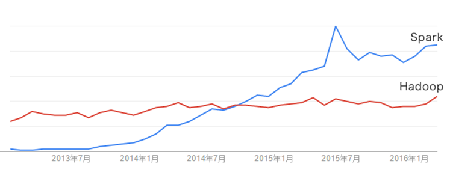

## Scala简介

Scala是一门现代的多范式编程语言，运行于Java平台（JVM，Java 虚拟机），并兼容现有的Java程序

Scala的特性：

- Scala具备强大的并发性，支持函数式编程，可以更好地支持分布式系统
- Scala语法简洁，能提供优雅的API

Scala兼容Java，运行速度快，且能融合到Hadoop生态圈中 

Scala是Spark的主要编程语言，但Spark还支持Java、Python、R作为编程语言

Scala的优势是提供了REPL（Read-Eval-Print Loop，交互式解释器），提高程序开发效率

开发Spark应用程序时，可以采用Scala、Python、Java和R等语言，首选语言是Scala，因为Spark这个软件本身就是使用Scala语言开发的，采用Scala语言编写Spark应用程序，可以获得最好的性能。关于采用哪种语言编写Spark应用程序，这里强调两点：

（1）Java代码太繁琐。在大数据应用场景中，不太适合使用Java，因为，完成同样的任务，Scala只需要一行代码，而Java则可能需要10行代码；而且，Scala语言可以支持交互式编程，大大提高了程序开发效率，而Java则不支持交互式执行，必须编译以后运行。

（2）Python语言并发性能不好。在并发性能方面，Scala要明显优于Python，而且，Scala是静态类型，可以在编译阶段就抛出错误，便于开发大型大数据项目，此外，Scala兼容Java，运行在JVM上，可以直接使用Java中的Hadoop API来和Hadoop进行交互，但是，Python与Hadoop之间的交互非常糟糕，通常都需要第三方库（比如hadoopy）。

## Spark与Hadoop的对比

Hadoop存在如下一些缺点：

- 表达能力有限
- 磁盘IO开销大
- 延迟高
  - 任务之间的衔接涉及IO开销
  - 在前一个任务执行完成之前，其他任务就无法开始，难以胜任复杂、多阶段的计算任务 

Spark在借鉴Hadoop MapReduce优点的同时，很好地解决了MapReduce所面临的问题

相比于Hadoop MapReduce，Spark主要具有如下优点：

- Spark的计算模式也属于MapReduce，但不局限于Map和Reduce操作，还提供了多种数据集操作类型，编程模型比Hadoop MapReduce更灵活
- Spark提供了内存计算，可将中间结果放到内存中，对于迭代运算效率更高

Spark基于DAG的任务调度执行机制，要优于Hadoop MapReduce的迭代执行机制 

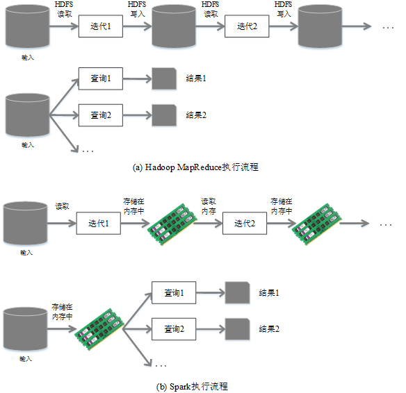

- 使用Hadoop进行迭代计算非常耗资源
- Spark将数据载入内存后，之后的迭代计算都可以直接使用内存中的中间结果作运算，避免了从磁盘中频繁读取数据

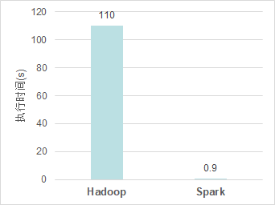

# Spark生态系统

在实际应用中，大数据处理主要包括以下三个类型

- 复杂的批量数据处理：通常时间跨度在数十分钟到数小时之间
- 基于历史数据的交互式查询：通常时间跨度在数十秒到数分钟之间
- 基于实时数据流的数据处理：通常时间跨度在数百毫秒到数秒之间

当同时存在以上三种场景时，就需要同时部署三种不同的软件

- 比如: MapReduce / Impala / Storm

这样做难免会带来一些问题： 

- 不同场景之间输入输出数据无法做到无缝共享，通常需要进行数据格式的转换
- 不同的软件需要不同的开发和维护团队，带来了较高的使用成本
- 比较难以对同一个集群中的各个系统进行统一的资源协调和分配

- Spark的设计遵循“一个软件栈满足不同应用场景”的理念，逐渐形成了一套完整的生态系统
- 既能够提供内存计算框架，也可以支持SQL即席查询、实时流式计算、机器学习和图计算等
- Spark可以部署在资源管理器YARN之上，提供一站式的大数据解决方案
- 因此，Spark所提供的生态系统足以应对上述三种场景，即同时支持批处理、交互式查询和流数据处理

Spark生态系统已经成为伯克利数据分析软件栈BDAS（Berkeley Data Analytics Stack）的重要组成部分

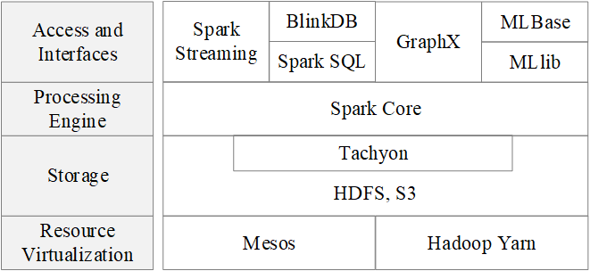

Spark的生态系统主要包含了Spark Core、Spark SQL、Spark Streaming（ Structured Streaming ）、MLLib和GraphX 等组件

# Spark运行架构

## 基本概念

- RDD：是Resillient Distributed Dataset（弹性分布式数据集）的简称，是分布式内存的一个抽象概念，提供了一种高度受限的共享内存模型
- DAG：是Directed Acyclic Graph（有向无环图）的简称，反映RDD之间的依赖关系
- Executor：是运行在工作节点（WorkerNode）的一个进程，负责运行Task
- 应用（Application）：用户编写的Spark应用程序
- 任务（ Task ）：运行在Executor上的工作单元 
- 作业（ Job ）：一个作业包含多个RDD及作用于相应RDD上的各种操作
- 阶段（ Stage ）：是作业的基本调度单位，一个作业会分为多组任务，每组任务被称为阶段，或者也被称为任务集合，代表了一组关联的、相互之间没有Shuffle依赖关系的任务组成的任务集

## 架构设计

- Spark运行架构包括集群资源管理器（Cluster Manager）、运行作业任务的工作节点（Worker Node）、每个应用的任务控制节点（Driver）和每个工作节点上负责具体任务的执行进程（Executor）
- 资源管理器可以自带或Mesos或YARN

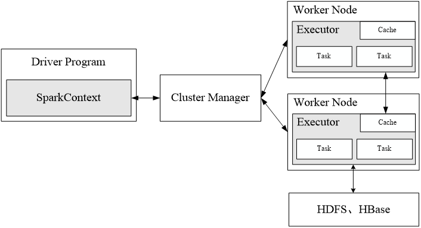

- 一个应用由一个Driver和若干个作业构成，一个作业由多个阶段构成，一个阶段由多个没有Shuffle关系的任务组成
- 当执行一个应用时，Driver会向集群管理器申请资源，启动Executor，并向Executor发送应用程序代码和文件，然后在Executor上执行任务，运行结束后，执行结果会返回给Driver，或者写到HDFS或者其他数据库中

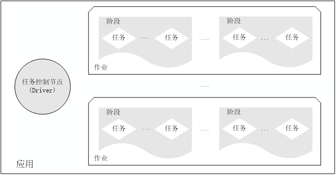

## Spark运行基本流程

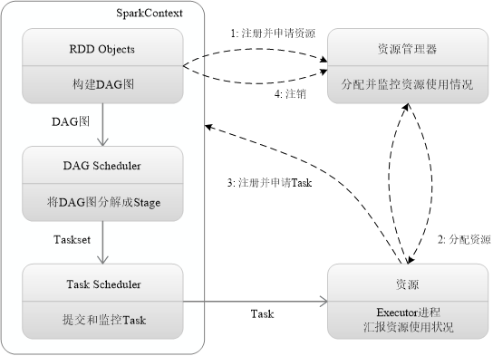

SparkContext对象代表了和一个集群的连接

1. 首先为应用构建起基本的运行环境，即由Driver创建一个SparkContext，进行资源的申请、任务的分配和监控
2. 资源管理器为Executor分配资源，并启动Executor进程
3. SparkContext根据RDD的依赖关系构建DAG图，DAG图提交给DAGScheduler解析成Stage，然后把一个个TaskSet提交给底层调度器TaskScheduler处理；Executor向SparkContext申请Task，Task Scheduler将Task发放给Executor运行，并提供应用程序代码
4. Task在Executor上运行，把执行结果反馈给TaskScheduler，然后反馈给DAGScheduler，运行完毕后写入数据并释放所有资源 

## RDD运行原理

### RDD设计背景

- 许多迭代式算法（比如机器学习、图算法等）和交互式数据挖掘工具，共同之处是，不同计算阶段之间会重用中间结果
- 目前的MapReduce框架都是把中间结果写入到稳定存储（比如磁盘）中，带来了大量的数据复制、磁盘IO和序列化开销
- RDD就是为了满足这种需求而出现的，它提供了一个抽象的数据架构，我们不必担心底层数据的分布式特性，只需将具体的应用逻辑表达为一系列转换处理，不同RDD之间的转换操作形成依赖关系，可以实现管道化，避免中间数据存储

无论是工业界还是学术界，都已经广泛使用高级集群编程模型来处理日益增长的数据，如MapReduce和Dryad。这些系统将分布式编程简化为自动提供位置感知性调度、容错以及负载均衡，使得大量用户能够在商用集群上分析超大数据集。

大多数现有的集群计算系统都是基于非循环的数据流模型。从稳定的物理存储（如分布式文件系统）中加载记录，记录被传入由一组确定性操作构成的DAG，然后写回稳定存储。DAG数据流图能够在运行时自动实现任务调度和故障恢复。

尽管非循环数据流是一种很强大的抽象方法，但仍然有些应用无法使用这种方式描述。我们就是针对这些不太适合非循环模型的应用，它们的特点是在多个并行操作之间重用工作数据集。这类应用包括：

1. 机器学习和图应用中常用的迭代算法（每一步对数据执行相似的函数）；
2. 交互式数据挖掘工具（用户反复查询一个数据子集）。

基于数据流的框架并不明确支持工作集，所以需要将数据输出到磁盘，然后在每次查询时重新加载，这带来较大的开销。

### RDD概念

- 一个RDD就是一个分布式对象集合，本质上是一个只读的分区记录集合，每个RDD可分成多个分区，每个分区就是一个数据集片段，并且一个RDD的不同分区可以被保存到集群中不同的节点上，从而可以在集群中的不同节点上进行并行计算
- RDD提供了一种高度受限的共享内存模型，即RDD是只读的记录分区的集合，不能直接修改，只能基于稳定的物理存储中的数据集创建RDD，或者通过在其他RDD上执行确定的转换操作（如map、join和group by）而创建得到新的RDD
- RDD提供了一组丰富的操作以支持常见的数据运算，分为“动作”（Action）和“转换”（Transformation）两种类型
- RDD提供的转换接口都非常简单，都是类似map、filter、groupBy、join等粗粒度的数据转换操作，而不是针对某个数据项的细粒度修改（不适合网页爬虫）
- 表面上RDD的功能很受限、不够强大，实际上RDD已经被实践证明可以高效地表达许多框架的编程模型（比如MapReduce、SQL、Pregel）
- Spark用Scala语言实现了RDD的API，程序员可以通过调用API实现对RDD的各种操作

RDD典型的执行过程如下：

- RDD读入外部数据源进行创建

- RDD经过一系列的转换（Transformation）操作，每一次都会产生不同的RDD，供给下一个转换操作使用

- 最后一个RDD经过“动作”操作进行转换，并输出到外部数据源 

这一系列处理称为一个Lineage（血缘关系），即DAG拓扑排序的结果

**优点：惰性调用、管道化、避免同步等待、不需要保存中间结果、每次操作变得简单**

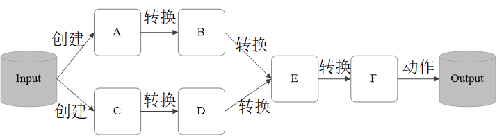

### RDD特性

Spark采用RDD以后能够实现高效计算的原因主要在于：

1. 高效的容错性

   - 现有容错机制：数据复制或者记录日志
   - RDD：血缘关系、重新计算丢失分区、无需回滚系统、重算过程在不同节点之间并行、只记录粗粒度的操作
2. 中间结果持久化到内存，数据在内存中的多个RDD操作之间进行传递，避免了不必要的读写磁盘开销
3. 存放的数据可以是Java对象，避免了不必要的对象序列化和反序列化

一般来说，分布式数据集的容错性有两种方式：即数据检查点和记录数据的更新。由于面向的是大规模数据分析，数据检查点操作成本很高：需要通过数据中心的网络连接在机器之间复制庞大的数据集，而网络带宽往往比内存带宽低得多，同时还需要消耗更多的存储资源（在内存中复制数据可以减少需要缓存的数据量，而存储到磁盘则会拖慢应用程序）。所以选择记录更新的方式。但是，如果更新太多，那么记录更新成本也不低。因此，RDD只支持读操作，并且只支持粗粒度转换，即在大量记录上执行的单个操作。将创建RDD的一系列转换记录下来（即Lineage），以便恢复丢失的分区。

虽然只支持粗粒度转换限制了编程模型，但是RDD仍然可以很好地适用于很多应用，特别是支持数据并行的批量分析应用，包括数据挖掘、机器学习、图算法等，因为这些程序通常都会在很多记录上执行相同的操作。

### RDD运行原理

#### RDD之间的依赖关系

- Shuffle操作
  - 什么是Shuffle操作

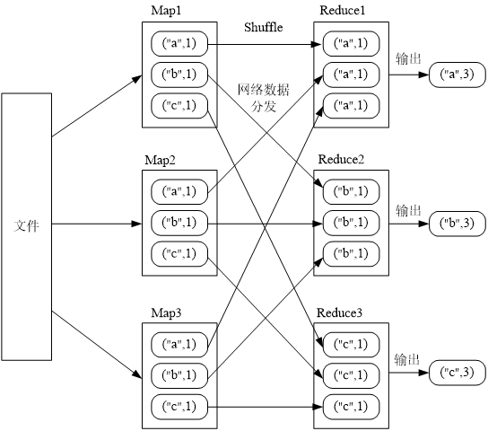

- 窄依赖和宽依赖
  - 是否包含Shuffle操作是区分窄依赖和宽依赖的根据

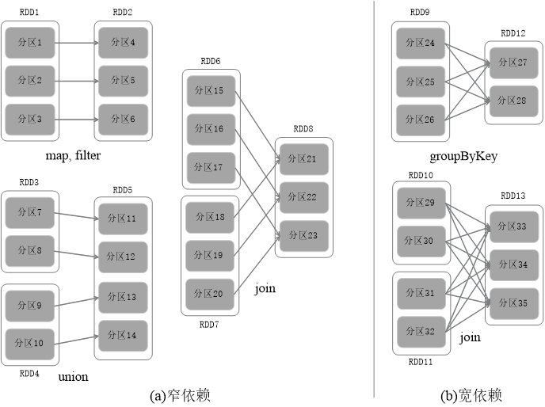

- 窄依赖表现为一个父RDD的分区对应于一个子RDD的分区或多个父RDD的分区对应于一个子RDD的分区
- 宽依赖则表现为存在一个父RDD的一个分区对应一个子RDD的多个分区

### 阶段的划分

Spark 根据DAG 图中的RDD 依赖关系，把一个作业分成多个阶段。阶段划分的依据是窄依赖和宽依赖。对于宽依赖和窄依赖而言，窄依赖对于作业的优化很有利，宽依赖无法优化

逻辑上，每个RDD 操作都是一个fork/join（一种用于并行执行任务的框架），把计算fork 到每个RDD 分区，完成计算后对各个分区得到的结果进行join 操作，然后fork/join下一个RDD 操作

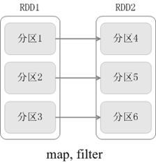

fork/join的优化原理

举例：一个学校（含2个班级）完成从北京到厦门的长征

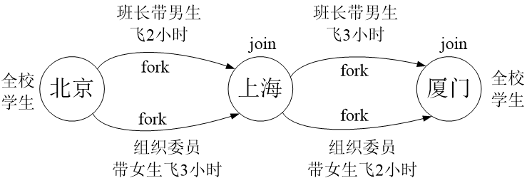

窄依赖可以实现“流水线”优化

宽依赖无法实现“流水线”优化

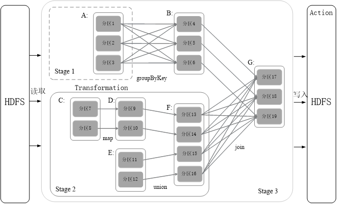

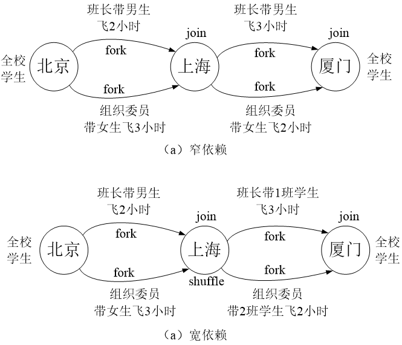

Spark根据DAG图中的RDD依赖关系，把一个作业分成多个阶段。对于宽依赖和窄依赖而言，窄依赖对于作业的优化很有利。只有窄依赖可以实现流水线优化，宽依赖包含Shuffle过程，无法实现流水线方式处理。

Spark通过分析各个RDD的依赖关系生成了DAG，再通过分析各个RDD中的分区之间的依赖关系来决定如何划分Stage，具体划分方法是：

- 在DAG中进行反向解析，遇到宽依赖就断开
- 遇到窄依赖就把当前的RDD加入到Stage中
- 将窄依赖尽量划分在同一个Stage中，可以实现流水线计算

#### Stage的划分

被分成三个Stage，在Stage2中，从map到union都是窄依赖，这两步操作可以形成一个流水线操作

**流水线操作实例**

分区7通过map操作生成的分区9，可以不用等待分区8到分区10这个map操作的计算结束，而是继续进行union操作，得到分区13，这样流水线执行大大提高了计算的效率

### RDD运行过程

通过上述对RDD概念、依赖关系和Stage划分的介绍，结合之前介绍的Spark运行基本流程，再总结一下RDD在Spark架构中的运行过程：

1. 创建RDD对象；
2. SparkContext负责计算RDD之间的依赖关系，构建DAG；
3. DAGScheduler负责把DAG图分解成多个Stage，每个Stage中包含了多个Task，每个Task会被TaskScheduler分发给各个WorkerNode上的Executor去执行。

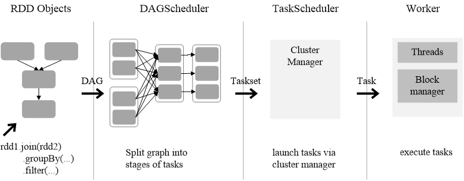

# Spark的部署方式

Spark支持三种不同类型的部署方式，包括：

- Standalone（类似于MapReduce1.0，slot为资源分配单位）
- Spark on Mesos（和Spark有血缘关系，更好支持Mesos）
- Spark on YARN

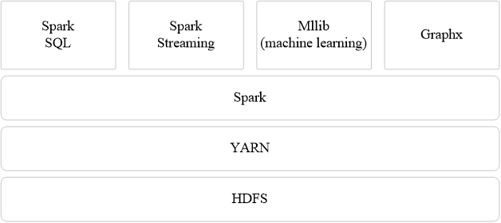

- 虽然Spark很快，但现在在生产环境中仍然不尽人意，无论扩展性、稳定性、管理性等方面都需要进一步增强
- 同时，Spark在流处理领域能力有限，如果要实现亚秒级或大容量的数据获取或处理需要其他流处理产品。Cloudera宣布旨在让Spark流数据技术适用于80%的使用场合，就考虑到了这一缺陷。我们确实看到实时分析（而非简单数据过滤或分发）场景中，很多以前使用S4或Storm等流式处理引擎的实现已经逐渐被Kafka+Spark Streaming代替
- Spark的流行将逐渐让MapReduce、Tez走进博物馆
- Hadoop现在分三块HDFS/MR/YARN，Spark比Hadoop性能好，只是Spark作为一个计算引擎，比MR的性能要好。但它的存储和调度框架还是依赖于HDFS/YARN，Spark也有自己的调度框架，但仍然非常不成熟，基本不可商用