# 序
这套流程主要是为了记录我在学习以及模型训练的过程，以及其中遇见的相关问题

## 环境

- CPU: Intel(R) Xeon(R) CPU E5-2680 v4 @ 2.40GHz
- MEM: 384GB 2400 DDR4
- GPU: Matrox Electronics Systems Ltd. G200eR2
- DISK: 1.1 TB
- System: Ubuntu 18.04 LTS
- Python: 3.6.7
- TensorFlow: 1.12.0

因为GPU并不是NVIDIA，所以不支持CUDA加速，目前只能使用CPU进行Tensorflow学习，在10月20日，Python版本升级到了3.7，然而到现在(11月28日)，Tensorflow还只支持3.6，故Python版本我们选择了3.6.7，也就是Python 3.6的最后一个版本

## 流程
1.安装Python  
2.编译并安装Tensorflow以及相关依赖  
3.安装Tensorflow Model  
4.使用labelImg进行图片标注  
5.修改Model代码，生成trainval.txt，将图片及标注文件转换成TFRecord  
6.下载一套COCO数据集，并更改pipeline.config  
7.进行40000次的模型训练，生成ckpt文件  
8.将ckpt转换成GRAPH的pb冻结图  
9.使用pb冻结图进行物品图片预测  

# Miniconda
conda和virtualenv一样，可用于Python项目做多版本环境创建与切换的，也就是在同一个环境中，可以存在几个不同python版本或者不同requirement的虚拟环境，在安装依赖更新包都十分方便，anaconda太大了，我也不需要那么多的包，所以我这里使用的是Miniconda

## 下载

首先我们需要下载Miniconda，可以[点击这里](https://conda.io/miniconda.html)，进入Miniconda的官网

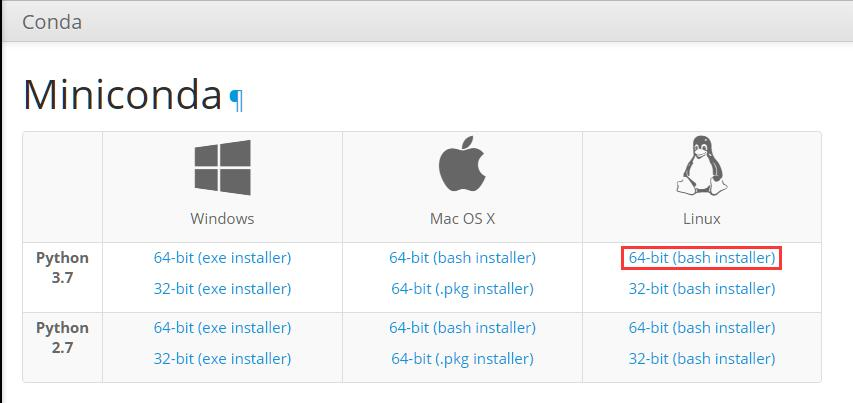

右键复制他的下载地址，通过wget进行下载

```
wget https://repo.anaconda.com/miniconda/Miniconda3-latest-Linux-x86_64.sh
```

等待进度条走完后完成下载

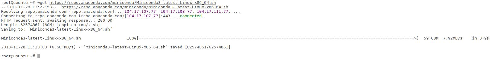

## 安装

现在完毕后我们使用bash命令运行这个sh文件

```
bash Miniconda3-latest-Linux-x86_64.sh
```

按下回车，查看Licenses，并输入yes进行下一步安装

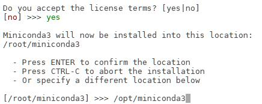

下一步输入安装路径，我这里是安装到了`/opt/miniconda3`这个目录下

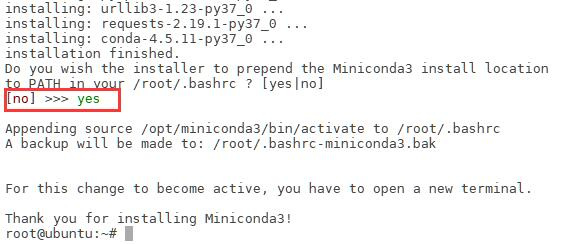

经过解包后，会提示你是否添加环境变量，这里我们选择yes，进行添加环境变量

最后完成环境Miniconda的安装

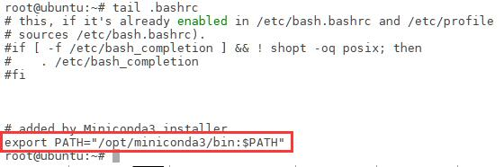

我们可以通过下面的命令查看环境变量是否添加

```
tail .bashrc
```

添加完环境变量后，我们需要用`source`更新一下，才能使环境变量生效

```
source .bashrc
```

## 使用

### 降级

因为Tensorflow现在只支持3.6版本的Python，然而我们下载的是最新版本的Miniconda，里面预装的是3.7最新版本的，所有我们需要进行降级，将python切换到3.6.7

```
conda install python=3.6.7
```

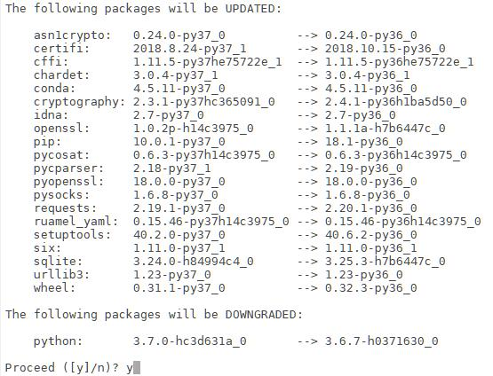

经过解析环境后`Solving environment`后，我们选择yes，进行降级操作

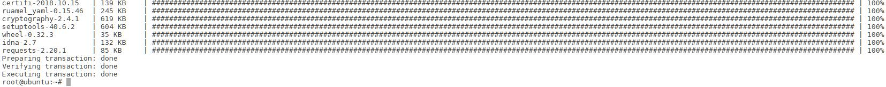

经过一段时间的等待，我们就成功的将Python版本降到了3.6.7

之后运行下面的命令 安装必要的包

```
conda install numpy keras-preprocessing 
```

### 更新

可以使用下面的命令进行conda升级

```
conda update conda
```

可以使用下面的命令进行当前所有包进行升级

```
conda update --all
```

### 清理

conda长时间使用后，体积会很大，可以使用下面命令将已经下载包进行清理

```
conda clean -a -y
```

## 卸载

如果需要需要卸载conda，可以用下面的命令将相应位置的Miniconda目录直接删除

```
rm -rf /opt/miniconda3/
```

然后使用下面的命令，编辑环境变量

```
vi ~/.bashrc
```

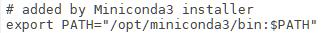

将环境变量中的关于conda的内容直接删除即可

# Tensorflow

Tensorflow目前分2个安装方法
- CPU版
- GPU版

除了通常的算术和逻辑，现代CPU提供了许多低级指令，称为扩展，例如， SSE2，SSE4，AVX等来自维基百科：
>高级矢量扩展（AVX）是英特尔在2008年3月提出的英特尔和AMD微处理器的x86指令集体系结构的扩展，英特尔首先通过Sandy Bridge处理器在2011年第一季度推出，随后由AMD推出Bulldozer处理器在2011年第三季度.AVX提供了新功能，新指令和新编码方案。  
特别是，AVX引入了融合乘法累加（FMA）操作，加速了线性代数计算，即点积，矩阵乘法，卷积等。几乎所有机器学习训练都涉及大量这些操作，因此将会支持AVX和FMA的CPU（最高达300％）更快。该警告指出您的CPU确实支持AVX（hooray！）。

在此强调一下：
>这只限于CPU。如果你有一个GPU，你不应该关心AVX的支持，因为大多数昂贵的操作将被分派到一个GPU设备上（除非明确地设置）。在这种情况下，您可以简单地忽略此警告。

那为什么会出现这种警告呢？
>由于tensorflow默认分布是在没有CPU扩展的情况下构建的，例如SSE4.1，SSE4.2，AVX，AVX2，FMA等。默认版本（来自pip install tensorflow的版本）旨在与尽可能多的CPU兼容。另一个观点是，即使使用这些扩展名，CPU的速度也要比GPU慢很多，并且期望在GPU上执行中型和大型机器学习培训。

我们机器没有GPU能够使用，为了尽可能多地利用CPU，且我们的CPU支持AVX，AVX2，为了更好效率，我们使用Bazel重新构建Tensorflow，不仅在以后的使用中，消除AVX等警报，还可以改善Tensorflow的性能

可以根据个人需求选择是否编译，也可以直接安装发行版本的Tensorflow

## JDK

安装Bazel，需要Java JDK1.8或更高版本的支持，所以我们的第一项工作就是安装JDK

关于JDK的安装教程，可以[点击这里](/posts/jdk-install.html)查看。

## Bazel

### 依赖

首先运行下面的代码，安装Bazel相关依赖，因为我们已经安装过python就不需要安装了

```
apt-get install pkg-config zip g++ zlib1g-dev unzip
```

### 安装

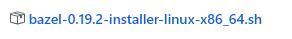

请[点击这里](https://github.com/bazelbuild/bazel/releases)打开Bazel Releases下载页面，选择相应版本进行下载

然后运行下面的命令，给sh文件加权限并运行

```
chmod +x bazel-0.19.2-installer-linux-x86_64.sh
./bazel-0.19.2-installer-linux-x86_64.sh
```

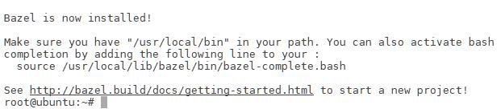

加载完毕后，看到Bazel is now installed!标明Bazel已安装成功

## 编译Tensorflow

首先我们先用git把Tensorflow的源码下载下来

```
git clone https://github.com/tensorflow/tensorflow.git
```

现在完毕后，我们需要运行configure,做一些必要的配置

```
cd tensorflow
./configure
```

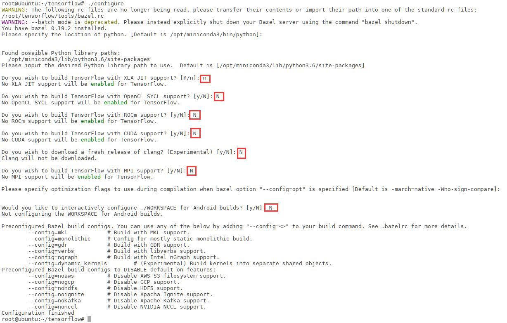

接下来，配置系统会给出各种询问，以确认编译时的配置参数，请根据个人情况配置参数，我这里全部选择的n，其他的为默认选项

在配置完Bazel的编译选项之后，接下来就可以使用如下指令编译TensorFlow的源代码

```
bazel build --config=opt //tensorflow/tools/pip_package:build_pip_package
```

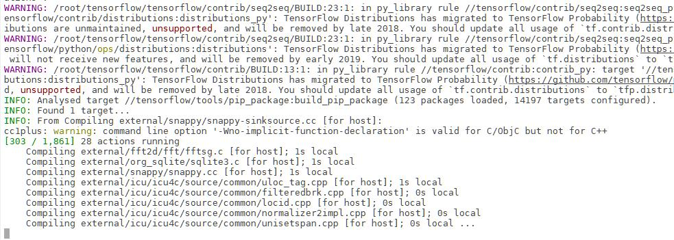

这个时候，我们就可以去喝喝水，休息一会，等待编译完毕即可

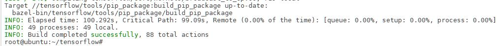

半个小时后，当我们看到这个提示，就标明tensorflow已经编译成功，在临时文件夹中生成了一堆binary，当前目录下也有软连接，可以直接运行下面的命令，生成whl文件，

```
bazel-bin/tensorflow/tools/pip_package/build_pip_package /tmp/tensorflow_pkg
```

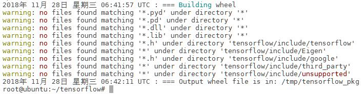

成功生成whl文件

## 安装Tensorflow

接下来运行下面的命令，直接安装生成的whl
```
pip install /tmp/tensorflow_pkg/tensorflow-1.12.0rc0-cp36-cp36m-linux_x86_64.whl
```

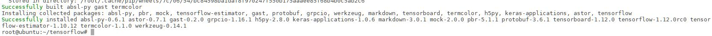

在经过相关依赖安装之后，提示安装成功

接下来我们可以跑一个例子

```
cd ~
python
import tensorflow as tf
a = tf.constant(2)
b = tf.constant(3)
with tf.Session() as sess:
    print("Addition with constants: %i" % sess.run(a+b))
```

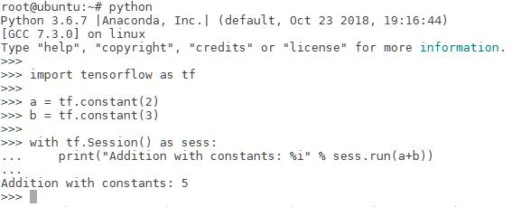

如图所示，可以得到结果，则说明Tensorflow已成功安装了

# Tensorflow Object Detection API

Tensorflow Object Detection API可实现基于给定模型检测图像中的特定目标，是典型的深度学习在计算机视觉中的应用

包含在Tensorflow Model中

Tensorflow旧版本自带model，然而新版本已经没有了，就需要我们自己单独下载

## 下载

首先运行下面的命令，安装Tensorflow Object Detection API的依赖
```
conda install Cython contextlib2 pillow lxml jupyter matplotlib
```
虽然都在本次教程中，都不会全用上，但是以后总会用找到了

使用下面的命令，从Tensorflow models下载最新的文件
```
git clone https://github.com/tensorflow/models.git
```
如果网络不太好，就多clone几次，总会成功的

## COCO API installation

我们需要使用COCO预处理数据集，需要下载cocoapi，使用下面命令完成COCO API的安装

```
git clone https://github.com/cocodataset/cocoapi.git
cd cocoapi/PythonAPI
make
cp -r pycocotools <path_to_tensorflow>/models/research/
```

## Protobuf编译器安装和使用

Tensorflow对象检测API使用Protobufs配置模型和训练参数。

在使用框架之前，必须编译Protobuf库。


首先[点击这里](https://github.com/protocolbuffers/protobuf/releases)Protobuf Releases下载页面，选择相应版本进行下载

然后使用下面的命令解压zip的包到存储的目录下

```
unzip -d /opt/protoc protoc-3.6.1-linux-x86_64.zip
```

并将下面的信息添加至环境变量到.bashrc
```
export PATH="/opt/protoc/bin:$PATH"
```

添加完毕并source更新环境变量后，运行以下命令来编译Protobuf库
```
cd /opt/models/research/
protoc object_detection/protos/*.proto --python_out=.
```

## 将库添加到PYTHONPATH

在本地运行时，models/research/和slim目录应该附加到PYTHONPATH。这可以通过从tensorflow/models/research/运行以下命令来完成：
```
export PYTHONPATH=$PYTHONPATH:`pwd`:`pwd`/slim
```
>此命令需要从您启动的每个新终端运行。如果您希望避免手动运行，可以将其作为新行添加到~/.bashrc文件的末尾，将`pwd`替换为系统上tensorflow/models/research的绝对路径。

如果你要添加环境变量，可以将下面的内容添加至环境变量并用source更新
```
export PATH="/opt/models/research:/opt/models/research/slim:$PATH"
```

## 测试安装

您可以测试是否已正确安装Tensorflow对象检测

通过运行以下命令API：
```
python object_detection/builders/model_builder_test.py
```

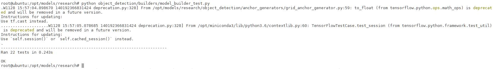

运行结果如图所示，表明Tensorflow Object Detection API已配置完毕

# LabelImg

首先需要先要标注图像相应标签，这里可以使用labelImg工具。

## 下载


请[点击这里](https://tzutalin.github.io/labelImg/)打开LabelImg Download list页面，下载合适版本的图片

## 使用

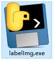

解压后，直接双击`labelImg.exe`文件运行

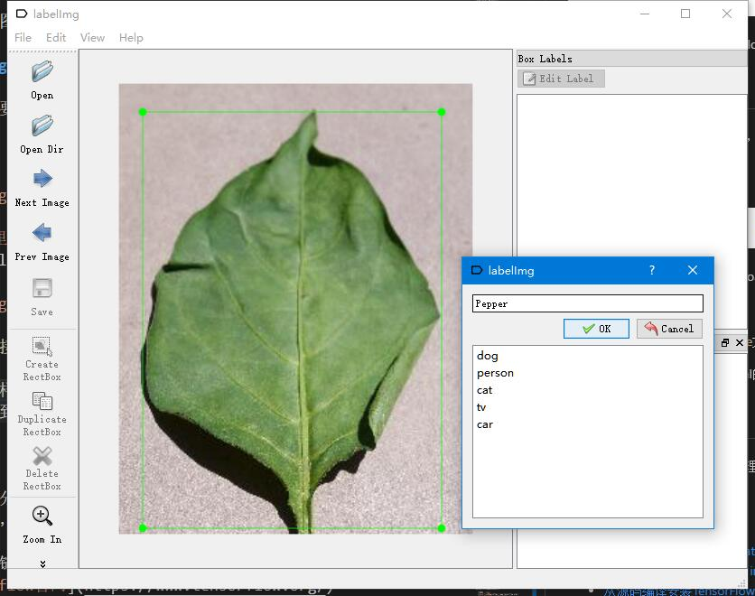

对对象物体画框，并记录相应对象的名称，save完成保存xml文件完成标注

每标注一张样本，即生成一个xml的标注文件

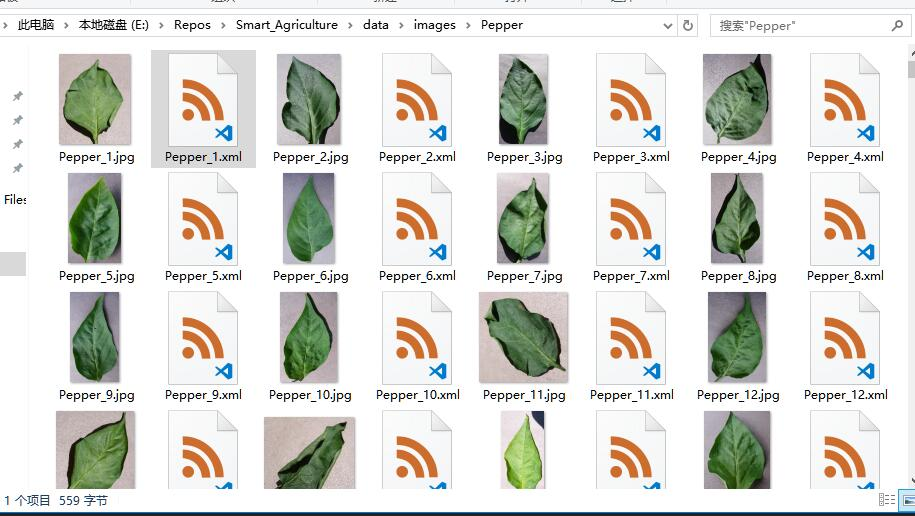

并分类别保存，记得保持图片名称及XML标注文件名称一致，最后同一类别文件夹效果如图所示

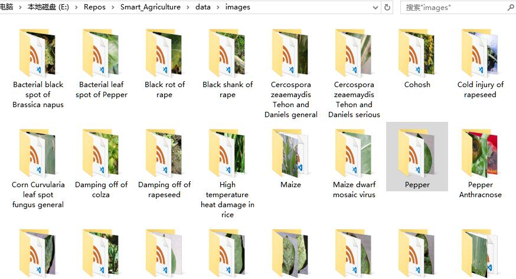

一次完成，每个类别保证有200张左右的样本，多个类别下的图片再统一放到一个目录下，效果如图所示

# 填写pbtxt文件

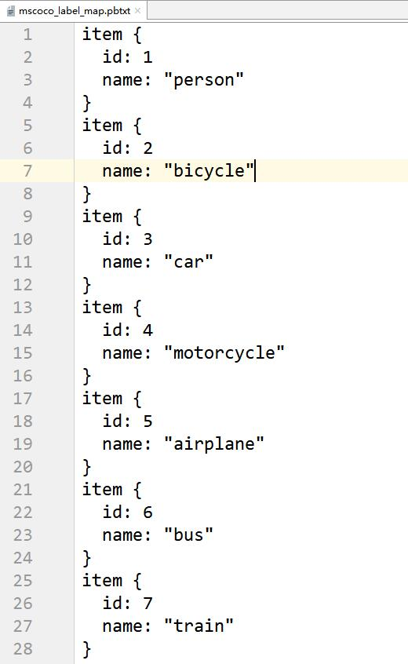

在图片预测的时候，并不会直接把对象名字反馈回来，所以我们需要一个映射文件pbtxt，进行标签名和数字的转换，格式如图所示

将自己标记的图片中对象及自己编号按照格式放到一个pbtxt文本中，之后会用得到

# trainval.txt文件生成

接下来就要进行TFRecord格式文件转换了，使用官方版的Api就可以生成trainval.txt，但是为了方便多个类别的使用，我对代码进行了一些更改，对类别下的样本进行随机，并按4:1的比率生成train.txt和val.txt，以保证总体样本上的随机，以提高数据的准确性

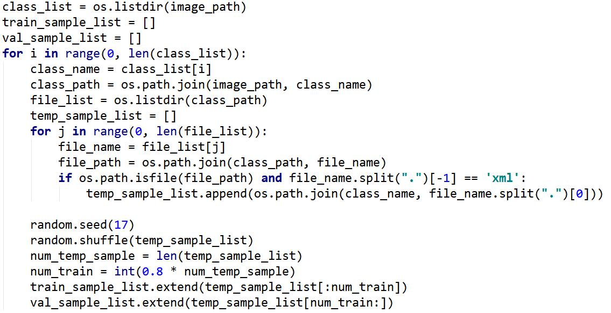

关键代码如图所示

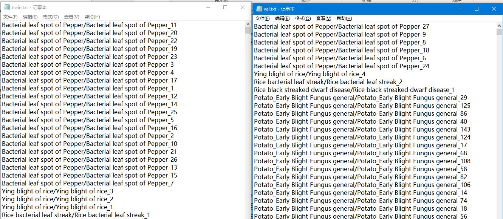

最后会生成2个文件内容如图所示

# TFRecord文件生成

在生成TFRecord的时候，会根据train.txt和val.txt的内容，逐条生成产生train.record和val.record

我是用的是object_detection/dataset_tools/create_pet_tf_record.py，并进行了一定的更改，对tainval分别处理，进行图片格式转换，都转换成JPEG格式，对mask去除，并将输出record保存为一个

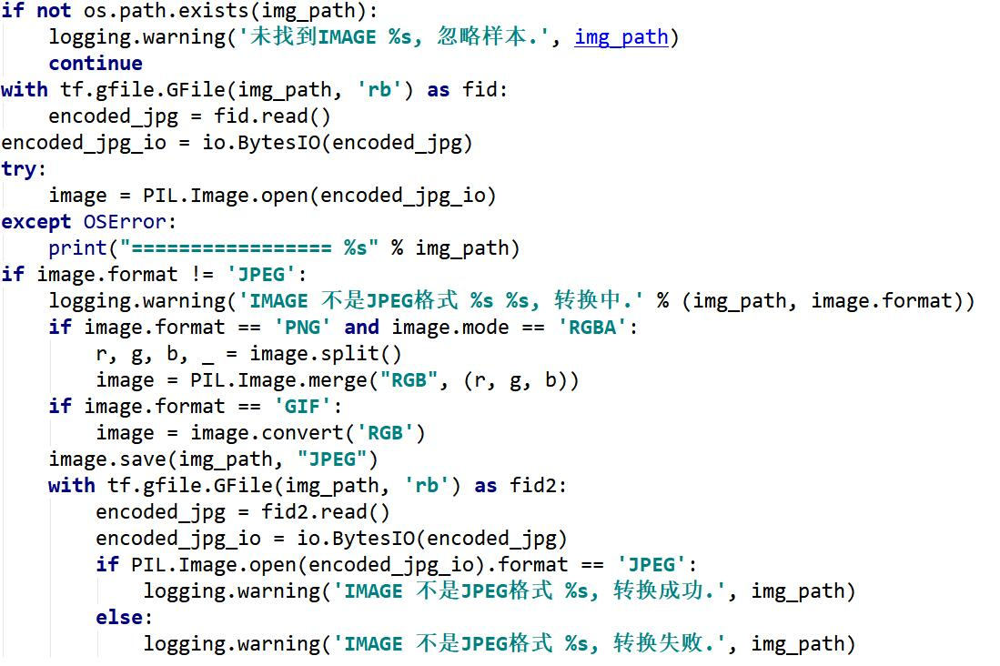

图片格式转换代码如图所示

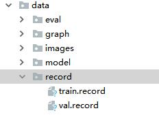

最后生成2个文件，以便进行下一步训练

# 预训练模型下载

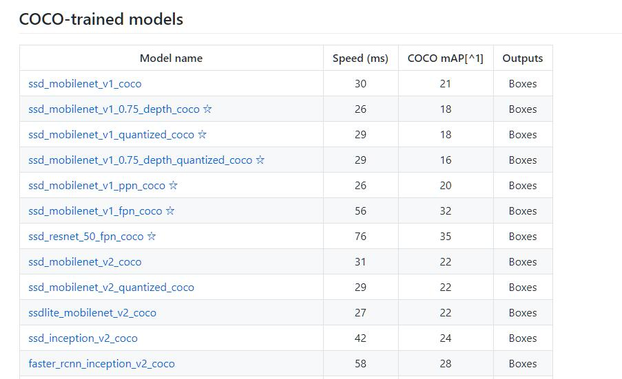

Tensorflow Object Detection API提供了很多模型进行下载，可以[点击这里](https://github.com/tensorflow/models/blob/master/research/object_detection/g3doc/detection_model_zoo.md)打开Tensorflow detection model zoo页面，选择想要的模型进行下载

我选择的是`ssd_inception_v2_coco`模型下载，下载后将`object_detection/samples/configs/ssd_inception_v2_coco.config`这里的文件放到解压后的模型下，并修改参数

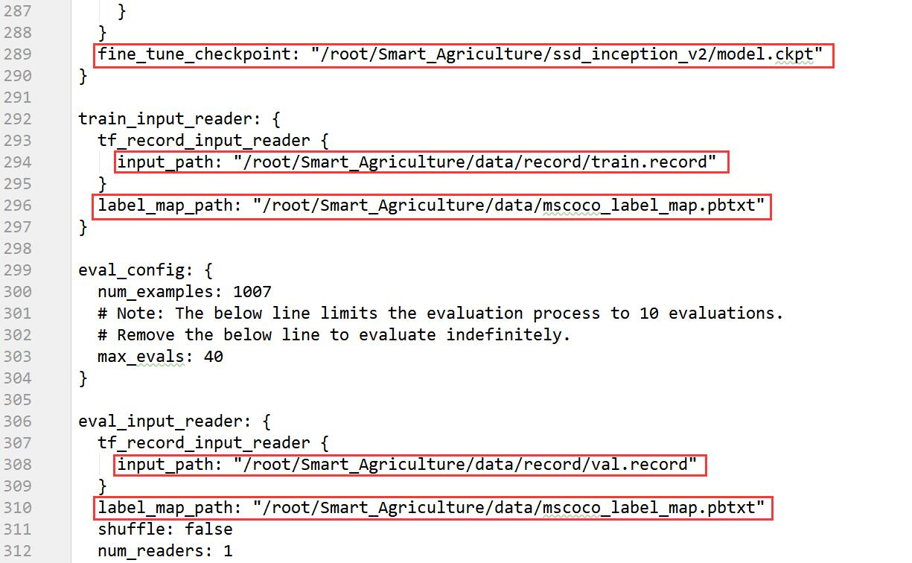

主要是5个地址进行修改，更换成刚刚生成好的tfreord文件地址，和模型下的ckpt地址

num_examples是val.txt中测试样本的数目

num_steps是训练步数

# train训练

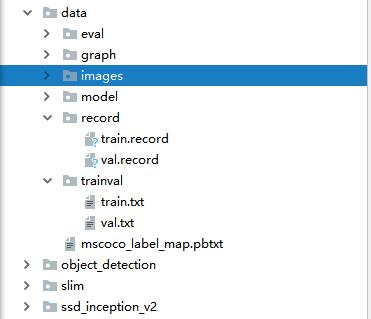

首先说明我的目录结构如图所示，我直接将`object_detection`和`slim`到工程文件夹下了，使用起来更方便

修改完毕后，我们就可以进行样本训练了

在早期的版本Tensorflow中，使用`train.py`进行训练，在`object_detection`目录下，现在已经搬到`object_detection\legacy`目录下了，现在还可以使用，使用命令如下
```
object_detection\legacy\train.py \
    --logtostderr \
    --pipeline_config_path=/root/<name_to_project>/ssd_inception_v2/pipeline.config \
    --train_dir=/root/<name_to_project>/data/model
```

在新版本的Tensorflow中，都是使用`model_main.py`进行训练，在`object_detection`目录下，使用命令如下
```
object_detection\model_main.py \
    --model_dir=/root/<name_to_project>/data/model \
    --pipeline_config_path=/root/<name_to_project>/ssd_inception_v2/pipeline.config \
    --num_train_steps=40000
```

>`<name_to_project>`是我的项目名称

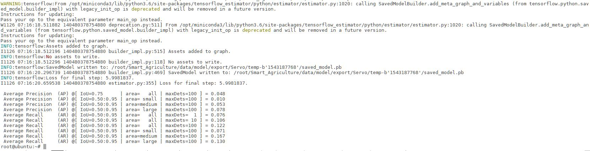

在经过漫长的等待(2天)后，日志终于结束打印

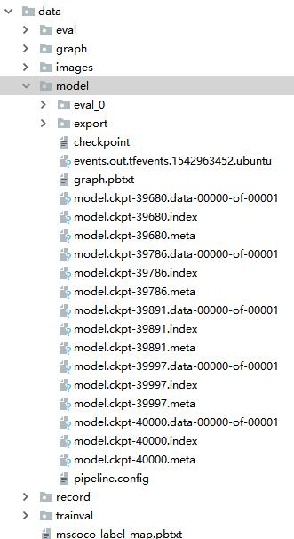

我们也可以在输出文件夹`data/model`中看到相应步数的检查点

# 导出推理图

要在代码中使用模型，需要将检查点文件（model.ckpt-STEP_NUMBER.*）转换为推理图。

你可以运行下面的代码，将检查点的ckpt文件转换成推理图
```
python object_detection\export_inference_graph.py \
    --input_type image_tensor \
    --pipeline_config_path /root/<name_to_project>/ssd_inception_v2/pipeline.config \
    --trained_checkpoint_prefix /root/<name_to_project>/data/model-bak/model.ckpt-20000 \
    --output_directory /root/<name_to_project>/data/graph
```

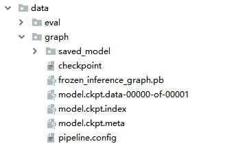

导出后的文件如图所示，我们使用的就是`frozen_inference_graph.pb`文件

# 测试模型

如何使用模型呢，我们可以[点击这里](https://github.com/tensorflow/models/blob/master/research/object_detection/object_detection_tutorial.ipynb)，这是Jupyter的运行文件，我们可以将运行代码拷贝到新建的一个python文件中，或者查找相应的转换工具使用

将`PATH_TO_TEST_IMAGES_DIR`参数改为自己要测试的图片
将`PATH_TO_FROZEN_GRAPH`参数改为`frozen_inference_graph.pb`的路径
将`PATH_TO_LABELS`参数改为`xxx.pbtxt`的路径

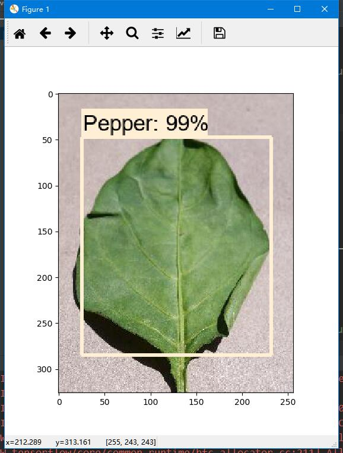

然后运行这个python，稍等片刻，我们就看到的预测结果

# 附件

相关链接：
- [Tensorflow官网](https://www.tensorflow.org/)
- [Tensorflow models installation](https://github.com/tensorflow/models/blob/master/research/object_detection/g3doc/installation.md)
- [警告：Your CPU supports instructions that this TensorFlow binary was not compiled to use: AVX2 FMA](https://blog.csdn.net/hq86937375/article/details/79696023)
- [从源码编译安装TensorFlow](http://www.hankcs.com/ml/compile-and-install-tensorflow-from-source.html)
- [TensorFlow安装以及models示例验证](https://blog.csdn.net/awedcvg/article/details/78158044)
- [目标检测标注工具labelImg使用方法](https://blog.csdn.net/xunan003/article/details/78720189)