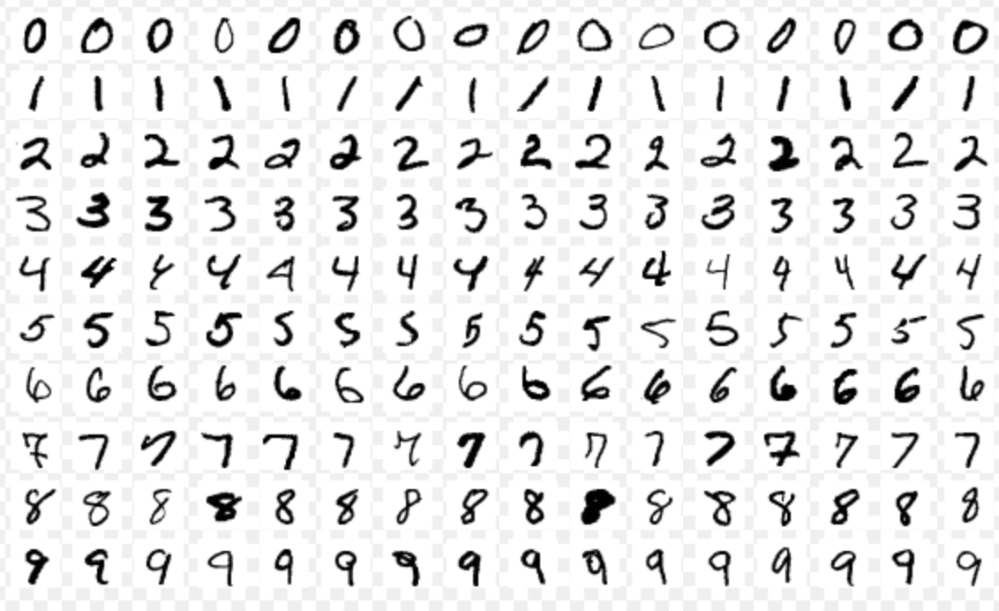
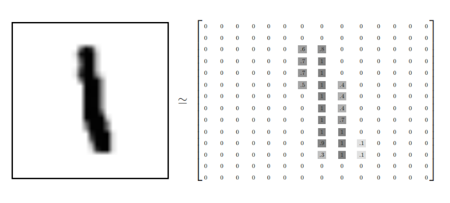
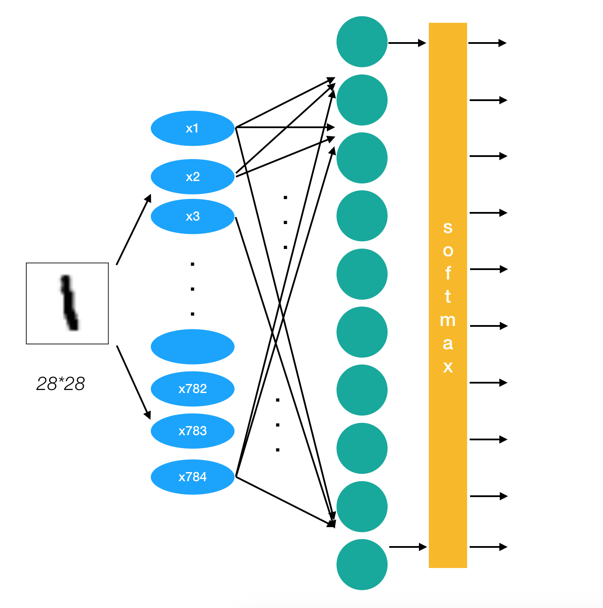

## 前言

目前我国垃圾分类存在的主要问题有三点：

1，垃圾分类正确率不高。

2，居民缺乏垃圾分类的意识和相关知识。

3，没有真正意义上的高效的垃圾分类系统。

基于以上，我们用深度学习的方法做垃圾分类。从技术上旨在通过深度学习，实现垃圾的高精确度分类。

## 神经网络
### 神经网络简介
人工神经网络（ Artificial Neural Network， 简写为ANN）也简称为神经网络（NN），是一种模仿生物神经网络结构和功能的计算模型。经典的神经网络结构包含三个层次的神经网络。分别为输入层，输出层以及隐藏层。


其中每层的圆圈代表一个神经元，隐藏层和输出层的神经元有输入的数据计算后输出，输入层的神经元只是输入。

- 神经网络的特点
  - 每个连接都有个权值
  - 同一层神经元之间没有连接
  - 最后的输出结果对应的层也称之为**全连接层**

神经网络是深度学习的重要算法，在图像（如图像的分类、检测）和自然语言处理（如文本分类、聊天等）有很多应用。

### 神经网络原理
神经网络分类的原理是怎么样的？我们还是围绕着损失、优化这两块去说。神经网络输出结果如何分类？


**神经网络解决多分类问题最常用的方法是设置n个输出节点，其中n为类别的个数。**

任意事件发生的概率都在0和1之间，且总有某一个事件发生（概率的和为1）。如果将分类问题中“一个样例属于某一个类别”看成一个概率事件，那么训练数据的正确答案就符合一个概率分布。如何将神经网络前向传播得到的结果也变成概率分布呢？Softmax回归就是一个非常常用的方法。

#### softmax回归

Softmax回归将神经网络输出转换成概率结果

$$softmax(y_i) = \frac{e^{y_i}}{\sum_{j=1}^{n}e^{y_i}}$$


如何理解这个公式的作用呢？看一下计算案例

```python
假设输出结果为：2.3, 4.1, 5.6
softmax的计算输出结果为：
y1_p = e^2.3/(e^2.3+e^4.1+e^5.6)
y2_p = e^4.1/(e^2.3+e^4.1+e^5.6)
y3_p = e^5.6/(e^2.3+e^4.1+e^5.6)
```

**这样就把神经网络的输出变成了概率输出**
那么如何去衡量神经网络预测的概率分布和真实答案的概率分布之间的距离？

#### 交叉熵损失

公式：

$$H_{y^{'}}(y)= - \sum_{i}y_{i}^{'} log(y_i)$$

为了能够衡量距离，目标值需要进行one-hot编码，能与概率值一一对应，如下图


损失值如何计算？

```python
-(0log(0.10)+0log(0.05)+0log(0.15)+0log(0.10)+0log(0.05)+0log(0.20)
	+1log(0.10)+0log(0.05)+0log(0.10)+0log(0.10))
```
上述的结果为-1log(0.10)，那么为了减少这一个样本的损失。神经网络应该怎么做？所以会提高对应目标值为1的位置输出概率大小，下面是log函数，log函数取正号之后单调递增的，取负号之后就单调递减。所以在减小损失值时相应的就会增大对应的概率值，同时根据softmax公式，其他类别的概率必定会减少。所以这里会提高对应目标值为1的位置输出概率大小。


那么神经网络是怎么来减少损失值或者是找到最小的损失值呢？

#### 梯度下降算法

目的：使损失函数的值找到最小值

函数的**梯度（gradient）**指出了函数的最陡增长方向。**沿着梯度的方向走，函数增长得就越快。那么按梯度的负方向走，函数值自然就降低得最快了**。模型的训练目标即是寻找合适的$w$与$b$以最小化损失函数值。假设**$w$与$b$都是一维实数**，那么可以得到如下的$J$关于$w$与$b$的图：


可以看到，此损失函数$J$是一个**凸函数**

参数w和b的更新公式为：
$$w := w - \alpha\frac{dJ(w, b)}{dw}$$

$$b := b - \alpha\frac{dJ(w, b)}{db}$$

> 注：其中 α 表示学习速率，即每次更新的 w 的步伐长度。当 w 大于最优解 w′ 时，导数大于 0，那么 w 就会向更小的方向更新。反之当 w 小于最优解 w′ 时，导数小于 0，那么 w 就会向更大的方向更新。迭代直到收敛。

通过平面来理解梯度下降过程：


#### 反向传播算法

反向传播算法实际就是：**我们使用链式求导法则，反向层层推进，计算出每一层神经节点的偏导数，然后使用梯度下降，不断调整每一个节点的权重，从而达到求得全局最小值的目的。**

## 案例：Mnist手写数字识别
### 数据集介绍



文件说明：

- train-images-idx3-ubyte.gz: training set images (9912422 bytes)
- train-labels-idx1-ubyte.gz: training set labels (28881 bytes)
- t10k-images-idx3-ubyte.gz: test set images (1648877 bytes)
- t10k-labels-idx1-ubyte.gz: test set labels (4542 bytes)

> 网址：http://yann.lecun.com/exdb/mnist/

Mnist数据集可以从官网下载，网址： **http://yann.lecun.com/exdb/mnist/** 下载下来的数据集被分成两部分：55000行的训练数据集（mnist.train）和10000行的测试数据集（mnist.test）。每一个MNIST数据单元有两部分组成：一张包含手写数字的图片和一个对应的标签。我们把这些图片设为“xs”，把这些标签设为“ys”。训练数据集和测试数据集都包含xs和ys，比如训练数据集的图片是 mnist.train.images ，训练数据集的标签是 mnist.train.labels。


我们可以知道图片是黑白图片，每一张图片包含28像素X28像素。我们把这个数组展开成一个向量，长度是 28x28 = 784。因此，在MNIST训练数据集中，mnist.train.images 是一个形状为 [60000, 784] 的张量。


MNIST中的每个图像都具有相应的标签，0到9之间的数字表示图像中绘制的数字。用的是one-hot编码


###  Mnist数据获取API

TensorFlow框架自带了读取这个数据集的接口：

- from tensorflow.examples.tutorials.mnist import input_data
  - mnist = input_data.read_data_sets(path, one_hot=True)
    - mnist.train.next_batch(100)(提供批量获取功能)
    - mnist.train.images、labels
    - mnist.test.images、labels

### 流程分析

#### 网络设计

我们采用只有一层，即最后一个输出层的神经网络，也称之为全连接层神经网络。



#### 相关计算

- tf.matmul(a, b, name=None)+bias
  - return:全连接结果，供交叉损失运算
- tf.train.GradientDescentOptimizer(learning_rate)
  - 梯度下降
  - learning_rate:学习率
  - method:
    - minimize(loss):最小优化损失

#### 具体流程

- 获取数据

```
from tensorflow.examples.tutorials.mnist import input_data
mnist = input_data.read_data_sets("./mnist_data/", one_hot=True)
```

- 定义数据占位符，Mnist数据实时提供给placeholder

```python
# 1、准备数据
# x [None, 784] y_true [None. 10]
with tf.variable_scope("mnist_data"):
    x = tf.placeholder(tf.float32, [None, 784])
    y_true = tf.placeholder(tf.int32, [None, 10])
```

- 全连接结果计算

```python
# 2、全连接层神经网络计算
# 类别：10个类别  全连接层：10个神经元
# 参数w: [784, 10]   b:[10]
# 全连接层神经网络的计算公式：[None, 784] * [784, 10] + [10] = [None, 10]
# 随机初始化权重偏置参数，这些是优化的参数，必须使用变量op去定义
with tf.variable_scope("fc_model"):
    weights = tf.Variable(tf.random_normal([784, 10], mean=0.0, stddev=1.0), name="w")
    bias = tf.Variable(tf.random_normal([10], mean=0.0, stddev=1.0), name="b")
    # fc层的计算
    # y_predict [None, 10]输出结果，提供给softmax使用
    y_predict = tf.matmul(x, weights) + bias
```

- 损失计算与优化

```python
# 3、softmax回归以及交叉熵损失计算
with tf.variable_scope("loss"):
    # labels:真实值 [None, 10]  one_hot
    # logits:全脸层的输出[None,10]
    # 返回每个样本的损失组成的列表
    loss = tf.reduce_mean(tf.nn.softmax_cross_entropy_with_logits(labels=y_true,
                                                                  logits=y_predict))
# 4、梯度下降损失优化
with tf.variable_scope("optimizer"):
    # 学习率
    optimizer = tf.train.GradientDescentOptimizer(0.1).minimize(loss)
```

- 模型训练

```python
# 开启会话去训练
with tf.Session() as sess:
    # 初始化变量
    sess.run(tf.global_variables_initializer())
    if FLAGS.is_train == 1:
        # 循环步数去训练
        for i in range(1000):
            # 获取数据，实时提供
            # 每步提供50个样本训练          
        		mnist_x, mnist_y = mnist.train.next_batch(100)
        		_, loss_value = sess.run([optimizer, loss], feed_dict={x:mnist_x, y:mnist_y})
        		print('第%d次训练, 损失值%.4f' %(i+1, loss_value))

```

#### 完善模型功能

- 如何计算准确率
  - equal_list = tf.equal(tf.argmax(y, 1), tf.argmax(y_label, 1))
  - accuracy = tf.reduce_mean(tf.cast(equal_list, tf.float32))
  
    
  

```python
# 5、得出每次训练的准确率（通过真实值和预测值进行位置比较，每个样本都比较）
with tf.variable_scope("accuracy"):
    equal_list = tf.equal(tf.argmax(y_true, 1), tf.argmax(y_predict, 1))
    accuracy = tf.reduce_mean(tf.cast(equal_list, tf.float32))
```
- 使用测试集评估模型

```python
# 6、定义一个flag判断是否是训练模式
tf.app.flags.DEFINE_integer("is_train", 1, "指定是否是训练模型，还是拿数据去预测")
FLAGS = tf.app.flags.FLAGS
...
# 每次拿十个样本预测
mnist_x, mnist_y = mnist.test.next_batch(10)
```

## 卷积神经网络

### 卷积神经网络简介

- 传统意义上的多层神经网络是只有输入层、隐藏层、输出层。其中隐藏层的层数根据需要而定，没有明确的理论推导来说明到底多少层合适
- 卷积神经网络CNN，在原来多层神经网络的基础上，加入了更加有效的特征学习部分，具体操作就是在原来的全连接层前面加入了卷积层与池化层。**卷积神经网络出现，使得神经网络层数得以加深，“深度”学习由此而来。**

> 通常所说的深度学习，**一般指的是这些CNN等新的结构以及一些新的方法（比如新的激活函数Relu等）**，解决了传统多层神经网络的一些难以解决的问题

### 卷积神经网络原理

先来看一个示意图：


#### 卷积神经网络三个结构

神经网络(neural networks)的基本组成包括输入层、隐藏层、输出层。而卷积神经网络的特点在于隐藏层分为卷积层和池化层(pooling layer，又叫下采样层)以及激活层。每一层的作用

- 卷积层：通过在原始图像上平移来提取特征
- 激活层：增加非线性分割能力
- 池化层：减少学习的参数，降低网络的复杂度（最大池化和平均池化）

为了能够达到分类效果，还会有一个全连接层(Full Connection)也就是最后的输出层，进行损失计算并输出分类结果。

#### 卷积层


**参数及结构**

四个超参数控制输出体积的大小：过滤器大小，深度，步幅和零填充。得到的每一个深度也叫一个Feature Map。

**卷积层的处理**，在卷积层有一个重要的就是过滤器大小（需要自己指定），若输入值是一个[32x32x3]的大小（例如RGB CIFAR-10彩色图像）。如果每个过滤器（Filter）的大小为5×5，则CNN层中的每个Filter将具有对输入体积中的[5x5x3]区域的权重，总共5 *5* 3 = 75个权重（和+1偏置参数），输入图像的3个深度分别与Filter的3个深度进行运算。请注意，沿着深度轴的连接程度必须为3，因为这是输入值的深度，并且也要记住这只是一个Filter。

- 假设输入卷的大小为[16x16x20]。然后使用3x3的示例接收字段大小，CNN中的每个神经元现在将具有总共3 *3* 20 = 180个连接到输入层的连接。

**卷积层的输出深度**，那么一个卷积层的输出深度是可以指定的，输出深度是由你本次卷积中Filter的个数决定。加入上面我们使用了64个Filter，也就是[5,5,3,64]，这样就得到了64个Feature Map，这样这64个Feature Map可以作为下一次操作的输入值

**卷积层的输出宽度**，输出宽度可以通过特定算数公式进行得出，后面会列出公式。

##### 卷积输出值的计算

我们用一个简单的例子来讲述如何计算卷积，然后，我们抽象出卷积层的一些重要概念和计算方法。

假设有一个5*5的图像，使用一个3*3的filter进行卷积，得到了到一个3*3的Feature Map，至于得到3*3大小，可以自己去计算一下。如下所示：


我们看下它的计算过程，首先计算公式如下：


根据计算的例子，第一次：


第二次：


通过这样我们可以依次计算出Feature Map中所有元素的值。下面的动画显示了整个Feature Map的计算过程：


**步长**

那么在卷积神经网络中有一个概念叫步长，也就是Filter移动的间隔大小。上面的计算过程中，步幅(stride)为1。步幅可以设为大于1的数。例如，当步幅为2时，我们可以看到得出2*2大小的Feature Map，发现这也跟步长有关。Feature Map计算如下：


##### 填充和多Filter

我们前面还曾提到，每个卷积层可以有多个filter。每个filter和原始图像进行卷积后，都可以得到一个Feature Map。因此，卷积后Feature Map的深度(个数)和卷积层的filter个数是相同的。

如果我们的步长移动与filter的大小不适合，导致不能正好移动到边缘怎么办？


以上就是卷积层的计算方法。这里面体现了局部连接和权值共享：每层神经元只和上一层部分神经元相连(卷积计算规则)，且filter的权值对于上一层所有神经元都是一样的。

**总结输出大小**

- 输入体积大小$H_1*W_1*D_1$
- 四个超参数：
  - Filter数量*K*
  - Filter大小*F*
  - 步长*S*
  - 零填充大小*P*
- 输出体积大小$H_2*W_2*D_2$
  - $H_2 = (H_1 - F + 2P)/S + 1$
  - $W_2 = (W_1 - F + 2P)/S + 1$
  - $D_2 = K$

#### 激活函数-Relu

一般在进行卷积之后就会提供给激活函数得到一个输出值。我们不使用$sigmoid$，$softmax$，而使用$Relu$。该激活函数的定义是：

$f(u)= max(0,u)$

Relu函数如下：


**特点**

- 速度快：与sigmoid函数需要计算指数和倒数相比，relu函数其实就是一个max(0,u)，计算代价小很多
- 稀疏性： 因为relu函数在输入小于0时是完全不激活的，因此可以获得一个更低的激活率。

#### 池化计算

池化层主要的作用是下采样，通过去掉Feature Map中不重要的样本，进一步减少参数数量。池化的方法很多，最常用的是Max Pooling。Max Pooling实际上就是在$n$个样本中取最大值，作为采样后的样本值。下图是max pooling：


除了Max Pooing之外，常用的还有Mean Pooling——取各样本的平均值。对于深度为D的Feature Map，各层独立做Pooling，因此Pooling后的深度仍然为D。

#### 全连接层
前面的卷积和池化相当于做特征工程，后面的全连接相当于做特征加权，最后的全连接层在整个卷积神经网络中起到“分类器”的作用。

### 实例探究

卷积网络领域有几种架构，名称。最常见的是：

- LeNet：卷积网络的第一个成功应用是由Yann LeCun于1990年代开发的。其中最著名的是LeNet架构，用于读取邮政编码，数字等。
- AlexNet：卷积网络在计算机视觉中的第一个应用是AlexNet，由亚历克斯·克里维斯基，伊利亚·萨茨基弗和吉奥夫·欣顿发展。AlexNet在2012年被提交给ImageNet ILSVRC挑战，明显优于第二名。该网络与LeNet具有非常相似的体系结构，但是使用更多层数，更大和更具特色的卷积层。
- ZFNet。ILSVRC 2013获奖者是Matthew Zeiler和Rob Fergus的卷积网络。它被称为ZFNet（Zeiler＆Fergus Net的缩写）。通过调整架构超参数，特别是通过扩展中间卷积层的大小，使第一层的步幅和过滤器尺寸更小，对AlexNet的改进。
- GoogleNet。ILSVRC 2014获奖者是Szegedy等人的卷积网络。来自Google。其主要贡献是开发一个初始模块，大大减少了网络中的参数数量（4M，与AlexNet的60M相比）。GoogLeNet还有几个后续版本，最近的是Inception-v4。
- VGGNet。2011年ILSVRC的亚军是来自Karen Simonyan和Andrew Zisserman的网络，被称为VGGNet。它的主要贡献在于表明网络的深度是良好性能的关键组成部分。他们最终的网络包含16个CONV / FC层，并且具有非常均匀的架构，从始至终只能执行3x3卷积和2x2池化。VGGNet的缺点是使用更多的内存和参数更多。
- ResNet。Kaiming He等人开发的残差网络 是ILSVRC 2015的获胜者。它大量使用特殊的跳过连接和批量归一化。该架构在网络末端也没有使用全连接层。ResNets目前是迄今为止最先进的卷积神经网络模型。

下面就是VGGNet的结构：

```
INPUT: [224x224x3]        memory:  224*224*3=150K   weights: 0
CONV3-64: [224x224x64]  memory:  224*224*64=3.2M   weights: (3*3*3)*64 = 1,728
CONV3-64: [224x224x64]  memory:  224*224*64=3.2M   weights: (3*3*64)*64 = 36,864
POOL2: [112x112x64]  memory:  112*112*64=800K   weights: 0
CONV3-128: [112x112x128]  memory:  112*112*128=1.6M   weights: (3*3*64)*128 = 73,728
CONV3-128: [112x112x128]  memory:  112*112*128=1.6M   weights: (3*3*128)*128 = 147,456
POOL2: [56x56x128]  memory:  56*56*128=400K   weights: 0
CONV3-256: [56x56x256]  memory:  56*56*256=800K   weights: (3*3*128)*256 = 294,912
CONV3-256: [56x56x256]  memory:  56*56*256=800K   weights: (3*3*256)*256 = 589,824
CONV3-256: [56x56x256]  memory:  56*56*256=800K   weights: (3*3*256)*256 = 589,824
POOL2: [28x28x256]  memory:  28*28*256=200K   weights: 0
CONV3-512: [28x28x512]  memory:  28*28*512=400K   weights: (3*3*256)*512 = 1,179,648
CONV3-512: [28x28x512]  memory:  28*28*512=400K   weights: (3*3*512)*512 = 2,359,296
CONV3-512: [28x28x512]  memory:  28*28*512=400K   weights: (3*3*512)*512 = 2,359,296
POOL2: [14x14x512]  memory:  14*14*512=100K   weights: 0
CONV3-512: [14x14x512]  memory:  14*14*512=100K   weights: (3*3*512)*512 = 2,359,296
CONV3-512: [14x14x512]  memory:  14*14*512=100K   weights: (3*3*512)*512 = 2,359,296
CONV3-512: [14x14x512]  memory:  14*14*512=100K   weights: (3*3*512)*512 = 2,359,296
POOL2: [7x7x512]  memory:  7*7*512=25K  weights: 0
FC: [1x1x4096]  memory:  4096  weights: 7*7*512*4096 = 102,760,448
FC: [1x1x4096]  memory:  4096  weights: 4096*4096 = 16,777,216
FC: [1x1x1000]  memory:  1000 weights: 4096*1000 = 4,096,000

TOTAL memory: 24M * 4 bytes ~= 93MB / image (only forward! ~*2 for bwd)
TOTAL params: 138M parameters
```


## Inception-ResNet-v2介绍

### Inception

**问题：**

- 图像中突出部分的大小差别很大。例如，狗的图像可以是以下任意情况。每张图像中狗所占区域都是不同的。


*从左到右：狗占据图像的区域依次减小*

- 由于信息位置的巨大差异，为卷积操作选择合适的卷积核大小就比较困难。信息分布更全局性的图像偏好较大的卷积核，信息分布比较局部的图像偏好较小的卷积核。
- 非常深的网络更容易过拟合。将梯度更新传输到整个网络是很困难的。
- 简单地堆叠较大的卷积层非常消耗计算资源。

**解决方案：**

为什么不在同一层级上运行具备多个尺寸的滤波器呢？网络本质上会变得稍微「宽一些」，而不是「更深」。作者因此设计了 Inception 模块。

下图是「原始」Inception 模块。它使用 3 个不同大小的滤波器（1x1、3x3、5x5）对输入执行卷积操作，此外它还会执行最大池化。所有子层的输出最后会被级联起来，并传送至下一个 Inception 模块。


*原始 Inception 模块。*

### ResNet

随着网络的加深，出现了训练集准确率下降的现象，因为梯度反向传播到前面的层，重复相乘可能使梯度无穷小。结果就是，随着网络的层数更深，其性能趋于饱和，甚至开始迅速下降。所以作者针对这个问题提出了一种全新的网络，叫深度残差网络（ResNet）其核心思想是引入一个所谓的「恒等快捷连接」（identity shortcut connection），直接跳过一个或多个层，如下图所示：

 

### Inception-ResNet-v2

Google团队发布**Inception-ResNet-v2，它在ILSVRC图像分类基准测试中实现了当下最好的成绩。Inception-ResNet-v2是早期Inception V3模型变化而来，从微软的残差网络（ResNet）论文中得到了一些灵感。


## 使用Inception-ResNet-v2进行垃圾分类

### 数据集介绍

下载链接https://github.com/garythung/trashnet/blob/master/data/dataset-resized.zip

数据集一共分了六个类别，分别是：cardboard glass metal paper plastic trash，一共2527个样本


*glass样本示例*

### 处理流程

#### 数据预处理：

- 设置数据类别
```python
class_names_to_ids = {'cardboard': 0, 'glass': 1, 'metal': 2, 'paper':3, 'plastic':4, 'trash':5}
```

- 把文件名及类别写入文件

```python
import os
data_dir = 'dataset/'
output_path = 'list.txt'
fd = open(output_path, 'w')
for class_name in class_names_to_ids.keys():
    images_list = os.listdir(data_dir + class_name)
    for image_name in images_list:
        fd.write('{}/{} {}\n'.format(class_name, image_name, class_names_to_ids[class_name]))
fd.close()
```

- 划分训练集合测试集

```python
# 随机选取样本做训练集和测试集
import random
_NUM_VALIDATION = 505
_RANDOM_SEED = 0
list_path = 'list.txt'
train_list_path = 'list_train.txt'
val_list_path = 'list_val.txt'
fd = open(list_path)
lines = fd.readlines()
fd.close()
random.seed(_RANDOM_SEED)
random.shuffle(lines)
fd = open(train_list_path, 'w')
for line in lines[_NUM_VALIDATION:]:
    fd.write(line)
fd.close()
fd = open(val_list_path, 'w')
for line in lines[:_NUM_VALIDATION]:
    fd.write(line)
fd.close()
```

- 加载数据

  - 解析训练集测试集文件名

  ```python
  def get_train_test_data(list_file):
      list_train = open(list_file)
      x_train = []
      y_train = []
      for line in list_train.readlines():
          x_train.append(line.strip()[:-2])
          y_train.append(int(line.strip()[-1]))
          #print(line.strip())
      return x_train, y_train
  x_train, y_train = get_train_test_data('list_train.txt')
  x_test, y_test = get_train_test_data('list_val.txt')
  ```

  - 加载并预处理数据

  ```python
  def process_train_test_data(x_path):
      images = []
      for image_path in x_path:
          img_load = load_img('dataset/'+image_path)
          img = image.img_to_array(img_load)
          img = preprocess_input(img)
          images.append(img)
      return images
  train_images = process_train_test_data(x_train)
  test_images = process_train_test_data(x_test)
  ```

#### 构造模型

这里使用预先keras中已经训练好的InceptionResNetV2模型，模型的最后一层全连接层加载模型时不加载，按照我们需要分类的类别数进行设置。

```python
from keras.applications.inception_resnet_v2 import InceptionResNetV2
base_model = InceptionResNetV2(include_top=False, pooling='avg')
outputs = Dense(6, activation='softmax')(base_model.output)
model = Model(base_model.inputs, outputs)
```

#### 模型训练与保存

```python
# 设置ModelCheckpoint，按照验证集的准确率进行保存
save_dir='train_model'
filepath="model_{epoch:02d}-{val_acc:.2f}.hdf5"
checkpoint = ModelCheckpoint(os.path.join(save_dir, filepath), monitor='val_acc',verbose=1, 
                            save_best_only=True)
# 模型设置
def acc_top3(y_true, y_pred):
    return top_k_categorical_accuracy(y_true, y_pred, k=3)
  
def acc_top5(y_true, y_pred):
    return top_k_categorical_accuracy(y_true, y_pred, k=5)

model.compile(optimizer='adam',
              loss='categorical_crossentropy',
              metrics=['accuracy', acc_top3, acc_top5])
# 模型训练
model.fit(np.array(train_images), to_categorical(y_train),
          batch_size=8,
          epochs=5,
          shuffle=True,
          validation_data=(np.array(test_images), to_categorical(y_test)),
          callbacks=[checkpoint])
```

```shell
# 训练结果输出示例
Train on 2022 samples, validate on 505 samples
Epoch 1/5
2022/2022 [==============================] - 238s 118ms/step - loss: 0.1213 - acc: 0.9629 - acc_top3: 0.9970 - acc_top5: 0.9990 - val_loss: 0.6070 - val_acc: 0.8653 - val_acc_top3: 0.9644 - val_acc_top5: 0.9921
Epoch 00001: val_acc improved from 0.86139 to 0.86535, saving model to train_model/model_01-0.87.hdf5
```

#### 模型加载与预测

```python
# 加载指定模型
model.load_weights('train_model/model_01-0.87.hdf5')
# 直接使用predict方法进行预测
y_pred = model.predict(np.array(test_images))
```

### 结果分析

可以看到在验证集上的top1准确率是86.53%，top3的准确率是96.44%，相比于Inception-ResNet-v2模型本身的准确率有一些提升，也说明我们在Inception-ResNet-v2微调之后的这个垃圾分类模型充分利用了原模型已经学习到的规律，并对我们这个特定数据集有很好的预测能力。

## 附件

相关链接：

* https://www.bilibili.com/video/av65697460