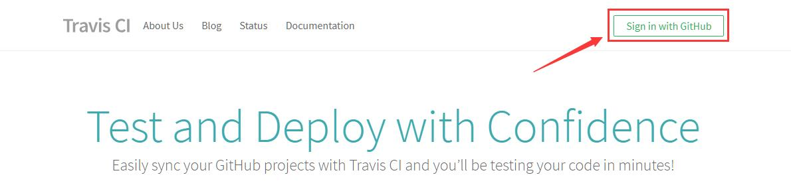
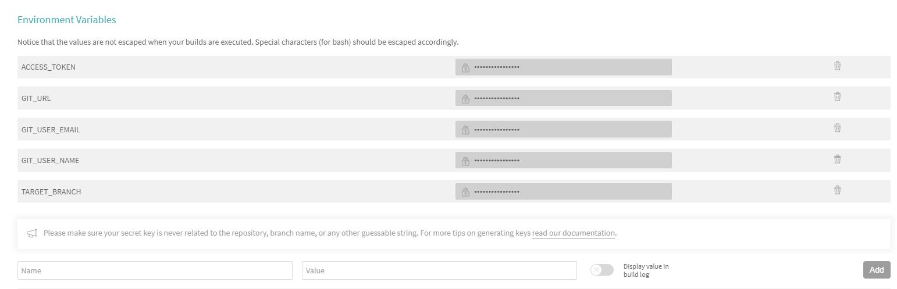
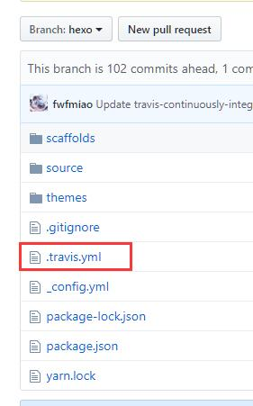
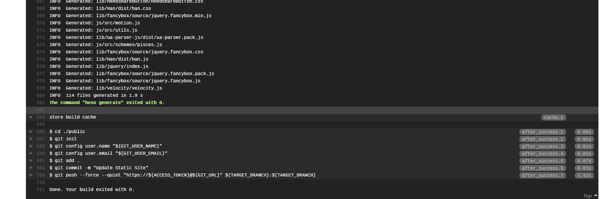

之前一直用hexo deploy更新博客，然后用git将hexo的源文件托管到另一个分支或者仓库，虽然这样可以让你能够备份下来hexo的源文件，但是这样实在太麻烦了，需要运行两次命令，还要切换分支什么的，十分麻烦。

后来在网上找到了一个十分简单得方法，就是持续集成

# 原理
每次原文件仓库或者分支更新文件后，Travis会把文件从Github上拉取下来，编译成静态文件后，然后直接Push到master的分支或者仓库，完成整个网页的更新。

# 配置流程
## Travis新建工程
首先登陆Travis的官网https://www.travis-ci.org/，选择右上角的Sign in with GitHub登陆。



然后右上角个人头像，选择Setting，Sync Account同步Github上的Repo信息

选择hexo的仓库，也就是 xxxx.github.io，进行启用

选择Github登陆即可，然后选择 NEW PROJECT ，新建一个项目，选择Github上Hexo的原文件或者分支，我是选择的是2原文件和静态页面在同一个仓库的2个分支。


## 获取AccessToken
travis.yml文件中需要几个参数，如果之前设置了环境变量，可以通过${xxxx}来表示，比如仓库地址就是${GIT_URL}，因为这个travis.yml直接保存到Github上面的，直接写密码肯定是不行的，所以可以使用有授权的AccessToken保存到里面。

可以[点击这里](https://github.com/settings/tokens)，进入Personal access tokens页面，然后点击Generate new token，获取一个新的token，Token description任意填写，下方的选项中全选repo即可。

将生成token保存起来，下面的流程会用到

## 配置travis环境变量

然后选择后面的Setting按钮，在Environment Variables栏下配置环境变量

填写完后保存，然后进入Environment设置，设置下面的环境变量，在之后配置.travis.yml文件会用到。

| 环境变量名        | 环境变量值                   | 示例 |
| ---------------- | --------------------------- | --------------------------- |
| GIT_URL          | 仓库地址                     | github.com/fwfmiao/fwfmiao.github.io.git |
| GIT_USER_EMAIL   | Github的用户邮箱             | xxxx@xxx.com |
| GIT_USER_NAME    | Github的用户名               | fwfmiao |
| ACCESS_TOKEN     | ACCESS_TOKEN                | xxxxxxxxxxxxx |
| SOURCE_BRANCH    | 编译源代码                   | hexo |
| TARGET_BRANCH    | 编译后静态文件保存的分支      | master |



我填写的情况如下，然后保存。

## .travis.yml配置
接下来是要把.travis.yml配置到原文件放置的分支根目录下，主要目的是在更新原文件后，能够让Travis按照.travis.yml里面写的内容，然后push到目标分支。

具体配置文件如下

```
language: node_js
node_js: stable

git:
  depth: 5
  quiet: true

branches:
  only:
  - hexo

install:
  - npm install

cache:
  directories:
    - node_modules

script:
  - hexo clean
  - hexo generate

after_success:
  - cd ./public
  - git init
  - git config user.name "${GIT_USER_NAME}"
  - git config user.email "${GIT_USER_EMAIL}"
  - git add .
  - git commit -m "Update Static Site"
  - git push --force --quiet "https://${ACCESS_TOKEN}@${GIT_URL}" ${TARGET_BRANCH}:${TARGET_BRANCH}
```
上面大概内容就是将github仓库的hexo分支拉取下来，编译成静态文件后，在push到目标(master)分支。由于Travis环境中是通过Access Token访问我们的仓库的，而Hexo自带的部署则在访问的过程中需要我们输入帐号密码，所以Hexo g -d的命令就不适合在这里使用。需要先编译成静态文件，然后直接把把public文件夹的静态文件push到目标分支。

# 使用流程



将.travis.yml放到分支根路径，push上去就可以了。

这时候就可以看到Travis自动运行.travis.yml文件，并进行CONSOLE的打印。



以后每次只需要对HEXO原代码那个分支进行更新就可以了，他会自动编译成静态文件再发布，十分方便，我们还可以加上一个这个小徽章_(:з」∠)_信仰充值。

[](https://www.travis-ci.org/fwfmiao/fwfmiao.github.io)