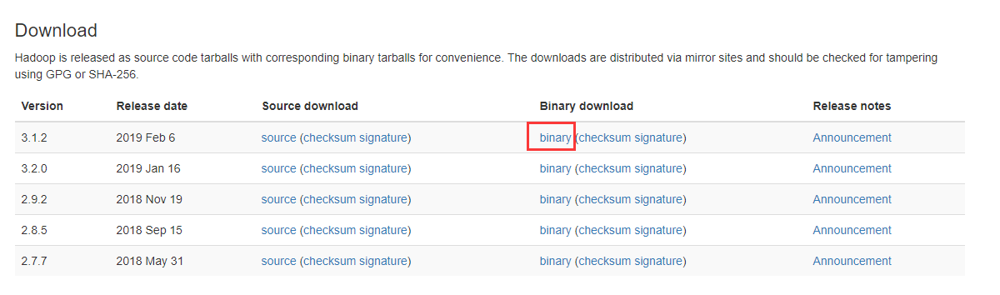
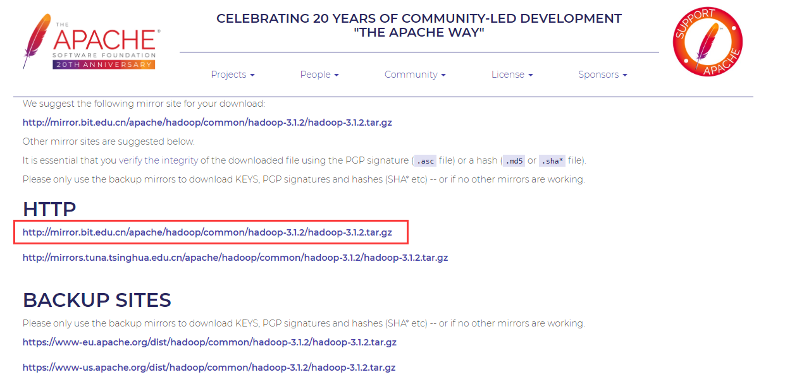
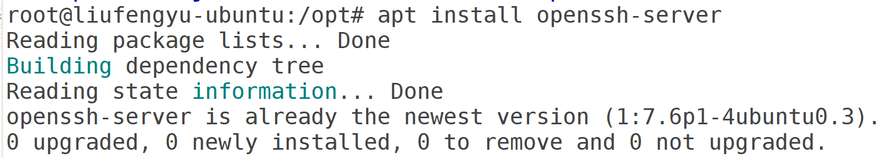
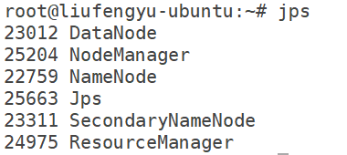
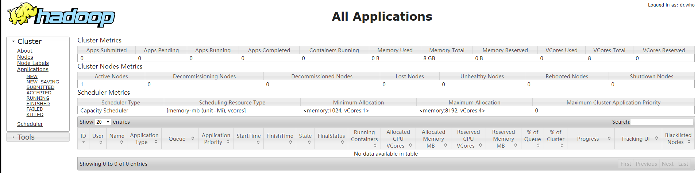
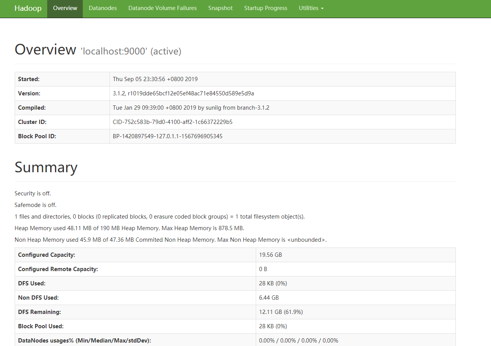
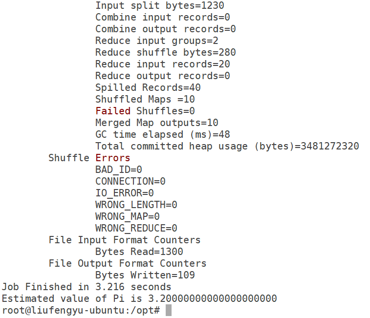

# 版本

- JDK: 8u221
- Hadoop: 3.1.2

# 下载

首先[点击这里](https://hadoop.apache.org/releases.html)，进入Hadoop官网下载页面。



选择3.0.3版本进行下载，然后点击binary地址进行下载



选中官方推荐的地址即可下载，其他地址也可用（建议采用迅雷等下载工具下载，速度比较会快很多，上传至UBUNTU系统）

或者使用`wget`命令进行下载

```
wget http://mirror.bit.edu.cn/apache/hadoop/common/hadoop-3.1.2/hadoop-3.1.2.tar.gz
```

# HOSTS

Hosts是一个没有扩展名的系统文件，可以用记事本等工具打开，其作用就是将一些常用的网址域名与其对应的IP地址建立一个关联“数据库”，当用户在浏览器中输入一个需要登录的网址时，系统会首先自动从Hosts文件中寻找对应的IP地址，一旦找到，系统会立即打开对应网页，如果没有找到，则系统会再将网址提交DNS域名解析服务器进行IP地址的解析。

为了机器能够快速识别自己以及其他机器，我们可以做一下域名和IP的hosts映射，这样在之后的操作中，我们就可以直接用域名来代替IP地址

## 伪分布模式

使用`vi /etc/hosts`命令添加master映射，并修改localhost

```
本机IP localhost
本机IP master
```

## 全分布模式

全分布模式下，需要你在每一台机器都设置好hosts，例如我有三台机器，IP分别为`192.168.0.1` `192.168.0.2` `192.168.0.3`，那么master主节点机器的hosts内容就如下进行设置

```
192.168.0.1 localhost

192.168.0.1 master
192.168.0.2 slave1
192.168.0.3 slave1
```

方便计算机互相连接

# SSH

## 简介

SSH 为 Secure Shell 的缩写，由 IETF 的网络小组（Network Working Group）所制定；SSH 为建立在应用层基础上的安全协议。SSH 是目前较可靠，专为远程登录会话和其他网络服务提供安全性的协议。

## 安装

Ubuntu中一般默认安装了ssh，如果没有安装，可以使用下面的命令进行安装

```
sudo apt-get install openssh-server
```



由于我的Ubuntu服务器已经安装好了SSH，所以提示我无需安装。安装好后，我们需要启动一下SSH服务。

## 查看并启动SSH

```
sudo ps -e | grep ssh
```

其中`ps -e`表示查看当前的进程，-e表示显示全部，效果同-A
`grep ssh`即`grep match_pattern`，是正则表达式，它会获取包含**match_pattern**的文本段


当有类似如上结果显示时，表示服务器的SSH服务正在运行中。如果没有则需要**启动SSH**服务，可以运行下面的命令：

```
service ssh start
```

或者

```
service ssh restart
```

## 查看并修改SSH设置

SSH的配置文件一般在`/etc/ssh/sshd_config`中

可以使用下面的命令编辑，或者使用`gedit`编辑

```
vi /etc/ssh/sshd_config
```

老版本的话，可能需要做如下修改才行。如果有`PermitRootLogin without-password`,加一个”#”号，注释掉该行，并增加一句`PermitRootLogin yes`

## 生成密钥对

使用下面的命令

```
ssh-keygen  -t rsa
```

该命令将在~/.ssh目录下面产生一个密钥id_rsa和一个公钥id_rsa.pub
将你的计算机(A)中的公钥传给别的计算机(B)，你才能免密码登录到计算机B

## 免密登录本机

首先使用下面的命令，将公钥发放给自己

```
cp ~/.ssh/id_rsa.pub ~/.ssh/authorized_keys
```

你可以进入`~/.ssh/`路径下，更方便的进行操作

需要查看`authorized_keys`文件的权限，需要保证是600,

如果权限不正确，请使用下面的命令

```
chmod 600 authorized_keys
```

然后使用下面的命令，免密连接本机

```
ssh localhost
```


当有类似结果如上图所示，表示你已经可以成功免密登录了

## 全分布模式(免密登录到别的计算机）

如果你需要登录到别的计算机，你需要将`id_rsa.pub`发送给别的电脑同样的路径，保存到`authorized_keys`文件中，如果对方计算机也要免密登录到你的计算机，也需要将它的`id_rsa.pub`发送到你的电脑同样的路径，保存到`authorized_keys`文件中

如果是多个计算机，比如三个（master slave1 slave2）,最方便的方法就是，每台计算机先运行`ssh-keygen  -t rsa`生成`id_rsa.pub`文件，然后创建一个记事本，将3个`id_rsa.pub`文件中的内容都保存起来，然后重命名为`authorized_keys`，然后使用下面`scp`命令，直接发放给每台计算机，发放时需要输入每天计算机密码，设置完毕后，再进行传输就不需要了

```
scp ~/.ssh/authorized_keys slave1:~/.ssh/authorized_keys
scp ~/.ssh/authorized_keys slave2:~/.ssh/authorized_keys
```

**记得检查权限**

# 环境配置

下载完毕后，使用下面的命令，将hadoop解压出来，并移动到合适的位置，我解压到了`/opt`目录下

```
tar -zxvf ./hadoop-3.1.2.tar.gz -C /opt
```

之后，需要配置以下的环境变量

使用vi命令编辑`vi /etc/profile`，添加下面的环境变量

```
# HADOOP
export HADOOP_HOME=/opt/hadoop-3.1.2
export HADOOP_CONF_DIR=${HADOOP_HOME}/etc/hadoop
export PATH=${HADOOP_HOME}/bin:${HADOOP_HOME}/sbin:$PATH
```

添加完毕保存后，使用`source /etc/profile`更新环境变量

更新环境变量后，可以命令`hdfs`来检查环境变量是否配置成功


当有类似的命令提示如上图所示，表示你已经成功配置好环境变量了

# 部署

hadoop的部署分为3种模式，分别为**单机模式** **伪分布模式(单节点)** **全分布模式**三种

无论部署哪种模式，我们都需要先配置环境变量，我们选择配置系统变量，无论是否是当前路径都可以使用

## 单机模式

如果你只是进行单节点运行，那么你现在已经完成安装了，不需要启动，可以直接进入测试环节

## 伪分布模式

首先打开`/opt/hadoop-3.2.0/etc/hadoop`这个目录，分别编辑下面几个文件，根据个人需求更改参数：

### core-site.xml
```
<configuration>
  # 配置hdfs的namenode的地址，使用的是hdfs协议
  <property>
    <name>fs.defaultFS</name>
    <value>hdfs://master:9000</value>
  </property>
  # 配置hadoop运行时产生数据的存储目录，不是临时目录
  <property>
    <name>hadoop.tmp.dir</name>
    <value>/opt/tmp</value>
  </property>
</configuration>
```

master在hosts文件中做了映射，可以替换成本机IP

hadoop有时候并不能自己创建namenode和datanode文件夹，可以运行下面的命令手动创建这2个文件夹

```
mkdir -p /opt/data/namenode
mkdir -p /opt/data/datanode
mkdir -p /opt/tmp
```

### hdfs-site.xml

```
<configuration>
  # 配置在hdfs中，一份文件存几份，默认是3份，一台机器只能存一份，伪分布设置为1
  <property>
    <name>dfs.replication</name>
    <value>1</value>
  </property>
  # 是否打开权限检查系统
  <property>
    <name>dfs.permissions</name>
    <value>false</value>
  </property>
  # 命名空间和事务在本地文件系统永久存储的路径
  <property>
    <name>dfs.namenode.name.dir</name>
    <value>/opt/data/namenode</value>
  </property>
  # DataNode在本地文件系统中存放块的路径
  <property>
    <name>dfs.datanode.data.dir</name>
    <value>/opt/data/datanode</value>
  </property>
</configuration>
```

### yarn-site.xml
```
<configuration>
  # 指定yarn的resourcemanager的地址（该地址是resourcemanager的主机地址，即主机名或该主机的ip地址）
  <property>
    <name>yarn.resourcemanager.hostname</name>
    <value>master</value>
  </property>
  # 指定mapreduce执行shuffle时获取数据的方式
  <property>
    <name>yarn.nodemanager.aux-services</name>
    <value>mapreduce_shuffle</value>
  </property>
</configuration>
```

### mapred-site.xml

```
<configuration>
  # 指定mapreduce运行在yarn上
  <property>
    <name>mapreduce.framework.name</name>
    <value>yarn</value>
  </property>
  <property>
    <name>yarn.app.mapreduce.am.env</name>
    <value>HADOOP_MAPRED_HOME=/opt/hadoop-3.1.2</value>
  </property>
  <property>
    <name>mapreduce.map.env</name>
    <value>HADOOP_MAPRED_HOME=/opt/hadoop-3.1.2</value>
  </property>
  <property>
    <name>mapreduce.reduce.env</name>
    <value>HADOOP_MAPRED_HOME=/opt/hadoop-3.1.2</value>
  </property>
</configuration>
```

### hadoop-env.sh

在任意地方添加JAVA_HOME

```
export JAVA_HOME=你的JDK安装地址
```

所有配置文件修改完毕后，进入hadoop初始化步骤

## 全分布模式

首先打开`/opt/hadoop-3.2.0/etc/hadoop`这个目录，分别编辑下面几个文件，根据个人需求更改参数：

### core-site.xml

```
<configuration>
  # 配置hdfs的namenode的地址，使用的是hdfs协议
  <property>
    <name>fs.defaultFS</name>
    <value>hdfs://master:9000</value>
  </property>
  # 配置hadoop运行时产生数据的存储目录，不是临时目录
  <property>
    <name>hadoop.tmp.dir</name>
    <value>/opt/tmp</value>
  </property>
</configuration>
```

master在hosts文件中做了映射，可以替换成本机IP

hadoop有时候并不能自己创建namenode和datanode文件夹，可以运行下面的命令手动创建这2个文件夹

```
mkdir -p /opt/data/namenode
mkdir -p /opt/data/datanode
mkdir -p /opt/tmp
```

### hdfs-site.xml

```
<configuration>
  # 配置在hdfs中，一份文件存几份，默认是3份，一台机器只能存一份，小于datanode数量
  <property>
    <name>dfs.replication</name>
    <value>3</value>
  </property>
  # 是否打开权限检查系统
  <property>
    <name>dfs.permissions</name>
    <value>false</value>
  </property>
  # 命名空间和事务在本地文件系统永久存储的路径
  <property>
    <name>dfs.namenode.name.dir</name>
    <value>/opt/data/namenode</value>
  </property>
  # DataNode在本地文件系统中存放块的路径
  <property>
    <name>dfs.datanode.data.dir</name>
    <value>/opt/data/datanode</value>
  </property>
</configuration>
```

如果你只有3个datanode，但是你却指定副本数为4，是不会生效的，因为每个datanode上只能存放一个副本。

### yarn-site.xml

```
<configuration>
  # 指定yarn的resourcemanager的地址（该地址是resourcemanager的主机地址，即主机名或该主机的ip地址）
  <property>
    <name>yarn.resourcemanager.hostname</name>
    <value>master</value>
  </property>
  # 指定mapreduce执行shuffle时获取数据的方式
  <property>
    <name>yarn.nodemanager.aux-services</name>
    <value>mapreduce_shuffle</value>
  </property>
</configuration>
```

### mapred-site.xml

```
<configuration>
  # 指定mapreduce运行在yarn上
  <property>
    <name>mapreduce.framework.name</name>
    <value>yarn</value>
  </property>
</configuration>
```

### workers

```
master
slave1
slave2
```

老版本文件名为slaves，配置的是所有的从节点，用IP也可以，所有配置文件修改完毕后，进入hadoop初始化步骤

# Hadoop初始化

## 允许root账户运行

使用下面的命令进入hadoop脚本路径

```
cd $HADOOP_HOME/sbin/
```

使用`vi`编辑`start-dfs.sh`和`stop-dfs.sh`添加

```
HDFS_DATANODE_USER=root 
HDFS_DATANODE_SECURE_USER=hdfs 
HDFS_NAMENODE_USER=root 
HDFS_SECONDARYNAMENODE_USER=root
```

使用`vi`编辑`start-yarn.sh`和`stop-yarn.sh`添加

```
YARN_RESOURCEMANAGER_USER=root
HADOOP_SECURE_DN_USER=yarn
YARN_NODEMANAGER_USER=root
```

使用`vi`编辑`hadoop-env.sh`

## hdfs初始化

### 伪分布模式

然后使用下面的命令初始化hdfs

```
hdfs namenode -format
```


格式化完毕后，如图所示，则表示初始化成功，如果初始化失败，需要用下面的命令手动清空namenode和datanode文件夹，调整配置后，重新初始化

```
rm -rf /opt/data/namenode/*
rm -rf /opt/data/datanode/*
```

### 全分布模式

集群模式下，不能能只在主机进行hdfs初始化，还需要到每一台机子中运行下面的命令进行hdfs初始化

```
hdfs namenode -format
```

# 启动Hadoop
## 伪分布模式

初始化完毕后，我们就可以使用下面的命令启动hadoop了

```
start-yarn.sh & start-dfs.sh
```



启动完毕后可以使用`jps`命令查看启动的hadoop进程



可以访问 http://master:8088 查看所有任务的运行情况



可以访问 http://master:9870 查看Hadoop集群运行情况

至此整个hadoop就搭建好了

## 全分部模式

### Namenode

```
hdfs --daemon start namenode
hdfs --daemon stop namenode
hdfs --daemon restart namenode
```

### Datanode

```
hdfs --daemon start datanode
hdfs --daemon stop datanode
hdfs --daemon restart datanode
```

你可以使用上面的命令挨个启动namenode和datanode，如果已配置好workers和ssh免密登录，你可以使用下面的命令调用脚本直接启动所有hdfs进程

```
start-dfs.sh
```

### ResourceManager

```
yarn --daemon start resourcemanager
yarn --daemon stop resourcemanager
yarn --daemon restart resourcemanager
```

### NodeManager

```
yarn --daemon start nodemanager
yarn --daemon stop nodemanager
yarn --daemon restart nodemanager
```

你可以使用上面的命令挨个启动resourcemanager和nodemanager，如果已配置好workers和ssh免密登录，你可以使用下面的命令调用脚本直接启动所有yarn进程

```
start-yarn.sh
```

# 案例测试

## 词频统计

可以使用下面的命令进行一个wordcount的测试程序(命令已进行版本兼容，不需要修改直接运行即可)

```
mkdir input
cp $HADOOP_HOME/*.txt input
hadoop jar $HADOOP_HOME/share/hadoop/mapreduce/hadoop-mapreduce-examples-*.jar wordcount input output
```

之后通过`ls`查看当前目录下的文件


使用下面的命令可查看词频统计的结果

```
cat output/part-r-00000
```


当有类似的结果如上图所示，表示你已经成功搭建好了hadoop单机模式，并测试成功

## PI值计算

我们可以使用一个简单的例子来测试一下hadoop是否能够正常运行

我们从hadoop安装文件夹，启动一个终端，使用下面的命令，计算pi值
```
hadoop jar $HADOOP_HOME/share/hadoop/mapreduce/hadoop-mapreduce-examples-*.jar pi 10 10
```


如图所示，我们计算量比较少导致不够精确，但是已经可以成功运算出pi值了

# 附件

各配置文件参数描述

## core-site.xml
| 参数              | 属性值                        | 解释                                |
|-------------------|:----------------------------:|-------------------------------------|
| fs.defaultFS | hdfs://localhost:9000 | 配置hdfs的namenode的地址，使用的是hdfs协议 |
| hadoop.tmp.dir |  | 配置hadoop运行时产生数据的存储目录 |
| io.file.buffer.size | 65536 | 配置读/写缓存区的大小，以byte为单位，默认值是4KB |
一般情况下，可以设置为64KB（65536byte）

## hdfs-site.xml

| 参数              | 属性值                        | 解释                                |
|-------------------|------------------------------|-------------------------------------|
| dfs.replication | 1 | 分片数量，伪分布式将其配置成1即可 |
| dfs.permissions | false | 是否打开权限检查系统 |
| dfs.namenode.name.dir | /opt/data/namenode | 命名空间和事务在本地文件系统永久存储的路径 |
| dfs.datanode.data.dir | /opt/data/datanode | DataNode在本地文件系统中存放块的路径 |
## yarn-site.xml
| 参数              | 属性值                        | 解释                                |
|-------------------|------------------------------|-------------------------------------|
| yarn.nodemanager.aux-services | mapreduce_shuffle | NodeManager上运行的附属服务。需配置成mapreduce_shuffle，才可运行MapReduce程序 |
| yarn.nodemanager.auxservices.mapreduce.shuffle.class | org.apache.hadoop.mapred.ShuffleHandler | 是否打开权限检查系统 |
| yarn.resourcemanager.address | ${yarn.resourcemanager.hostname}:8032 | ResourceManager 对客户端暴露的地址。客户端通过该地址向RM提交应用程序，杀死应用程序等 |
| yarn.resourcemanager.scheduler.address | ${yarn.resourcemanager.hostname}:8030 | ResourceManager对ApplicationMaster暴露的访问地址。ApplicationMaster通过该地址向RM申请资源、释放资源等。 |
| yarn.resourcemanager.resource-tracker.address | ${yarn.resourcemanager.hostname}:8031 | ResourceManager 对NodeManager暴露的地址.。NodeManager通过该地址向RM汇报心跳，领取任务等 |
| yarn.resourcemanager.admin.address | ${yarn.resourcemanager.hostname}:8033 | ResourceManager 对管理员暴露的访问地址。管理员通过该地址向RM发送管理命令等 |
| yarn.resourcemanager.webapp.address | ${yarn.resourcemanager.hostname}:8088 | ResourceManager对外web ui地址。用户可通过该地址在浏览器中查看集群各类信息 |
| yarn.resourcemanager.scheduler.class | org.apache.hadoop.yarn.server.resourcemanager.scheduler.capacity.CapacityScheduler | 启用的资源调度器主类。目前可用的有FIFO、Capacity Scheduler和Fair Scheduler |
| yarn.resourcemanager.resource-tracker.client.thread-count | 50 | 处理来自NodeManager的RPC请求的Handler数目 |
| yarn.resourcemanager.scheduler.client.thread-count | 50 | 处理来自ApplicationMaster的RPC请求的Handler数目 |
| yarn.scheduler.minimum-allocation-mb/yarn.scheduler.maximum-allocation-mb | 1024/8192 | 单个可申请的最小/最大内存资源量。比如设置为1024和3072，则运行MapRedce作业时，每个Task最少可申请1024MB内存，最多可申请3072MB内存 |
| yarn.scheduler.minimum-allocation-vcores/yarn.scheduler.maximum-allocation-vcores | 1/32 | 单个可申请的最小/最大虚拟CPU个数。比如设置为1和4，则运行MapRedce作业时，每个Task最少可申请1个虚拟CPU，最多可申请4个虚拟CPU |
| yarn.resourcemanager.nodes.include-path/yarn.resourcemanager.nodes.exclude-path |  | NodeManager黑白名单。如果发现若干个NodeManager存在问题，比如故障率很高，任务运行失败率高，则可以将之加入黑名单中。注意，这两个配置参数可以动态生效 |
| yarn.resourcemanager.nodemanagers.heartbeat-interval-ms | 1000 | NodeManager心跳间隔 |