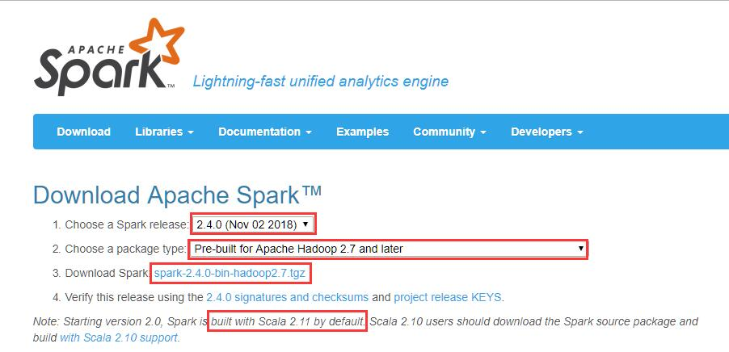
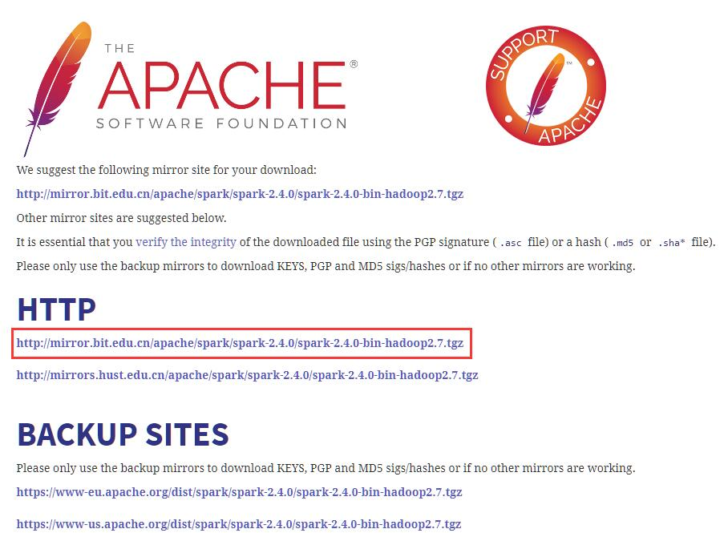
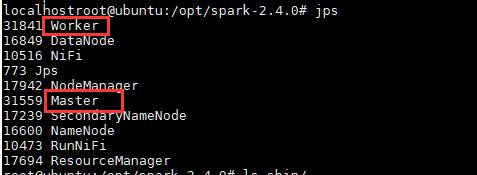
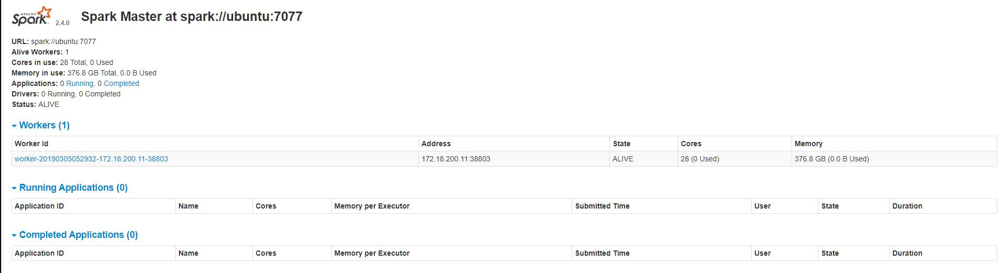
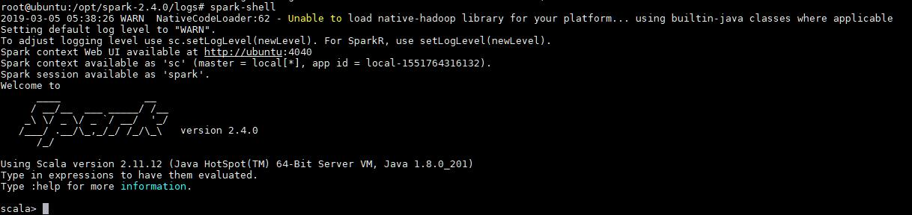

# 版本

- JDK: 8u221
- Scala: 2.12.9
- Hadoop: 3.1.2
- Spark: 2.4.4

# 下载

首先[点击这里](http://spark.apache.org/downloads.html)，进入Spark官网下载页面。



选择下载版本，以及Hadoop版本，然后点击tgz地址进行下载



选中官方推荐的地址即可下载，其他地址也可用（建议采用迅雷等下载工具下载，速度比较会快很多，上传至UBUNTU系统）

或者使用`wget`命令进行下载

```
wget http://mirror.bit.edu.cn/apache/spark/spark-2.4.4/spark-2.4.4-bin-hadoop2.7.tgz
```

# 配置

Spark部署模式总共有下面就几种

* local模式(单机模式)
  * local
  * local[k]
  * local[*]
* cluster模式(多机模式)
  * standalone
  * mesos
  * yarn
    * yarn cluster
    * yarn client

cluster模式肯定就是运行很多机器上了，但是它又分为以下三种模式，区别在于谁去管理资源调度。（说白了，就好像后勤管家，哪里需要资源，后勤管家要负责调度这些资源）

yarn模式又分为yarn cluster模式和yarn client模式：

- yarn cluster: 这个就是生产环境常用的模式，所有的资源调度和计算都在集群环境上运行。
- yarn client: 这个是说Spark Driver和ApplicationMaster进程均在本机运行，而计算任务在cluster上。

## 单机模式

local模式就是运行在一台计算机上的模式，通常就是用于在本机上练手和测试。它可以通过以下集中方式设置master。可以不进行任何配置，直接使用local部署模式运行

- local: 所有计算都运行在一个线程当中，没有任何并行计算，通常我们在本机执行一些测试代码，或者练手，就用这种模式。
- local[K]: 指定使用几个线程来运行计算，比如local[4]就是运行4个worker线程。通常我们的cpu有几个core，就指定几个线程，最大化利用cpu的计算能力
- local[*]: 这种模式直接帮你按照cpu最多cores来设置线程数了。

## Standalone模式

下载完毕后，使用下面的命令，将hadoop解压出来，并移动到合适的位置，我解压到了`/opt`目录下

```
tar -zxvf ./spark-2.4.4-bin-hadoop2.7.tgz  -C /opt
```

之后，需要配置以下的环境变量

使用vi命令编辑`vi /etc/profile`，添加下面的环境变量

```
# SPARK
export SPARK_HOME=/opt/spark-2.4.4
export PATH=${SPARK_HOME}/bin:${SPARK_HOME}/sbin:$PATH
```

添加完毕保存后，使用`source /etc/profile`更新环境变量

下面我们来验证一下看spark是否能正常启动

打开`/opt/spark-2.4.4/conf/`这个目录，使用`cp spark-env.sh.template spark-env.sh`，在最后端加入下面的参数

```
export JAVA_HOME=/opt/jdk1.8.0_221
export SCALA_HOME=/opt/scala-2.12.9
export SPARK_HOME=/opt/spark-2.4.4
export HADOOP_HOME=/opt/hadoop-3.1.2
export HADOOP_CONF_DIR=/opt/hadoop-3.1.2/etc/hadoop
export YARN_CONF_DIR=/opt/hadoop-3.1.2/etc/hadoop
export SPARK_MASTER_IP=master
export SPARK_LOCAL_IP=192.168.24.101
export SPARK_WORKER_CORES=1
export SPARK_WORKER_MEMORY=2g
```

使用`cp slaves.template slaves`，然后将所有worker机器节点ip或者域名加入其中 ，单节点使用默认的localhost即可


# 启动Spark

之后通过下面的命令启动Spark
```
start-mastar.sh
start-slaves.sh
```



启动完毕后可以使用`jps`命令查看启动的spark进程，如图表示，则说明我们已经将spark安装配置完毕了



可以访问 http://localhost:8088 查看所有任务的运行情况

# 案例测试

在控制台输入`spark-shell`



情况如图表示，则说明我们已经将spark安装配置完毕了

## PI值计算

可使用下面的命令来计算PI值

```
run-example SparkPi 10
```