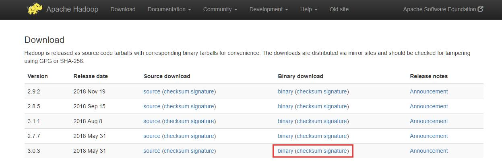
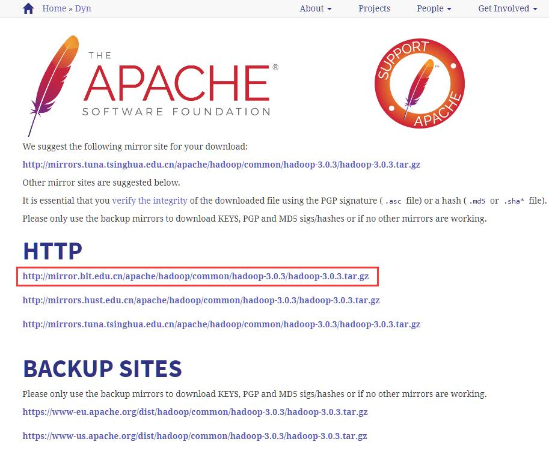
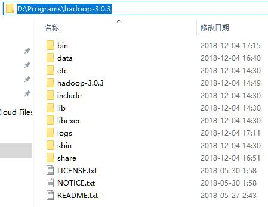
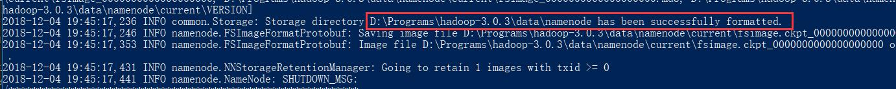
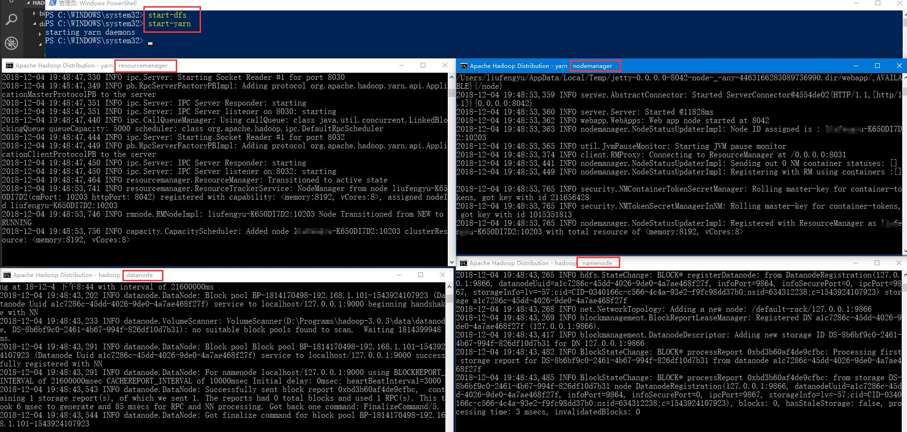
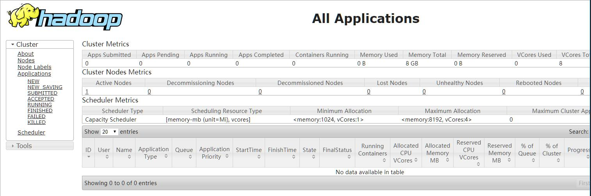
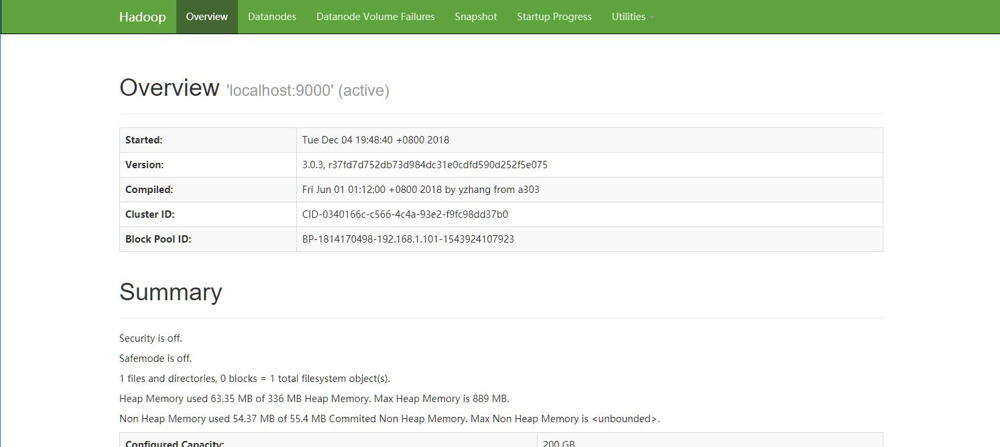
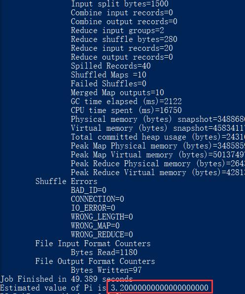
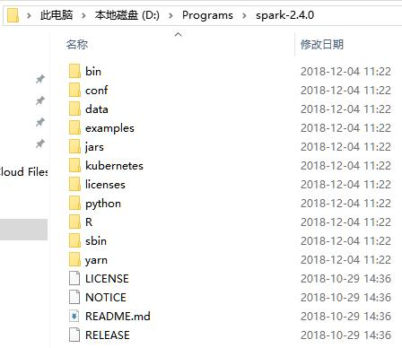
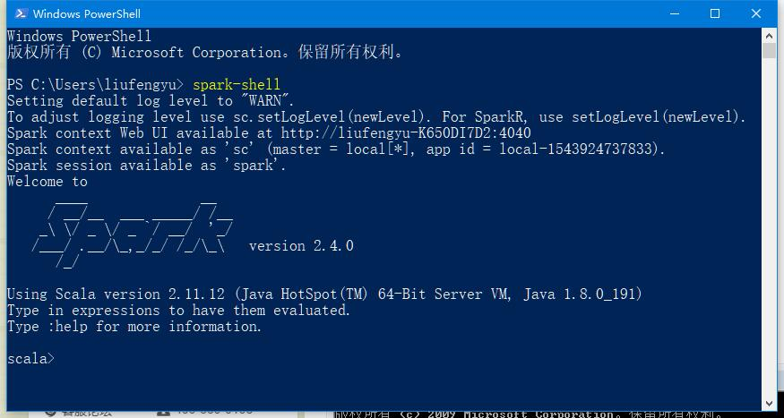

# 环境

- CPU: Intel(R) Core(TM) i7-4710MQ CPU @ 2.50GHz
- MEM: 16.0 GB
- System: Windows 10 Professional Edition
- Spark: 2.4.0
- Scala: 2.11.12

>从2.0版开始，Spark默认使用Scala 2.11构建。Scala 2.10用户应该下载Spark源包并[使用Scala 2.10支持](https://spark.apache.org/docs/latest/building-spark.html#building-for-scala-210)构建。

# JDK配置

关于JDK的安装教程，可以[点击这里](/posts/jdk-install.html)查看。

请注意hadoop不能识别空格，如果你安装在`C:\Program Files\Java\jdk1.8.0_191`这里，你需要将环境变量修改成`C:\Progra~1\Java\jdk1.8.0_191`

# Hadoop

## 下载

首先[点击这里](https://hadoop.apache.org/releases.html)，进入Hadoop官网下载页面。

>在windows下，我们需要hadoop.dll和winutils.exe，hadoop.dll防止报nativeio异常、winutils.exe没有的话报空指针异常  
可以[点击这里](https://github.com/steveloughran/winutils)进行下载



选择3.0.3版本进行下载，然后点击binary地址进行下载



选中官方推荐的地址即可下载，其他地址也可用（建议采用迅雷等下载工具下载，速度比较会快很多）

## 配置



将Spark解压到常用软件的目录下，比如我就保存在`D:\Programs\hadoop-3.0.3`这里，并修改了文件名，方便查看

接下来需要进行环境变量配置，变量如下：

| 变量名        | 变量值                        |
|---------------|------------------------------|
| HADOOP_HOME   | D:\Programs\hadoop-3.0.3     |
| Path          | %HADOOP_HOME%\bin            |
| Path          | %HADOOP_HOME%\sbin           |

>注意：path进行添加，而不是新建

环境变量修改后，我们需要对Hadoop进行参数配置，我配置的是单节点，所以不需要配置hosts

首先打开`D:\Programs\hadoop-3.0.3\etc\hadoop`这个目录，分别编辑下面几个文件，根据个人需求更改参数：

core-site.xml
```
<configuration>
  <property>
    <name>fs.defaultFS</name>
    <value>hdfs://localhost:9000</value>
  </property>
</configuration>
```
| 参数              | 属性值                        | 解释                                |
|-------------------|------------------------------|-------------------------------------|
| fs.defaultFS | hdfs://localhost:9000 | hdfs调用端口 |

hdfs-site.xml
```
<configuration>
  <property>
    <name>dfs.replication</name>
    <value>1</value>
  </property>
  <property>
    <name>dfs.permissions</name>
    <value>false</value>
  </property>
  <property>
    <name>dfs.namenode.name.dir</name>
    <value>file:/D:/Programs/hadoop-3.0.3/data/namenode</value>
  </property>
  <property>
    <name>dfs.datanode.data.dir</name>
    <value>file:/D:/Programs/hadoop-3.0.3/data/datanode</value>
  </property>
</configuration>
```
| 参数              | 属性值                        | 解释                                |
|-------------------|------------------------------|-------------------------------------|
| dfs.replication | 1 | 分片数量，伪分布式将其配置成1即可 |
| dfs.permissions | false | 是否打开权限检查系统 |
| dfs.namenode.name.dir | file:/D:/Programs/hadoop-3.0.3/data/namenode | 命名空间和事务在本地文件系统永久存储的路径 |
| dfs.datanode.data.dir | file:/D:/Programs/hadoop-3.0.3/data/datanode | DataNode在本地文件系统中存放块的路径 |

yarn-site.xml
```
<configuration>
  <property>
    <name>yarn.nodemanager.aux-services</name>
    <value>mapreduce_shuffle</value>
  </property>
</configuration>
```
| 参数              | 属性值                        | 解释                                |
|-------------------|------------------------------|-------------------------------------|
| yarn.nodemanager.aux-services | mapreduce_shuffle | NodeManager上运行的附属服务。需配置成mapreduce_shuffle，才可运行MapReduce程序 |
| yarn.nodemanager.auxservices.mapreduce.shuffle.class | org.apache.hadoop.mapred.ShuffleHandler | 是否打开权限检查系统 |
| yarn.resourcemanager.address | ${yarn.resourcemanager.hostname}:8032 | ResourceManager 对客户端暴露的地址。客户端通过该地址向RM提交应用程序，杀死应用程序等 |
| yarn.resourcemanager.scheduler.address | ${yarn.resourcemanager.hostname}:8030 | ResourceManager对ApplicationMaster暴露的访问地址。ApplicationMaster通过该地址向RM申请资源、释放资源等。 |
| yarn.resourcemanager.resource-tracker.address | ${yarn.resourcemanager.hostname}:8031 | ResourceManager 对NodeManager暴露的地址.。NodeManager通过该地址向RM汇报心跳，领取任务等 |
| yarn.resourcemanager.admin.address | ${yarn.resourcemanager.hostname}:8033 | ResourceManager 对管理员暴露的访问地址。管理员通过该地址向RM发送管理命令等 |
| yarn.resourcemanager.webapp.address | ${yarn.resourcemanager.hostname}:8088 | ResourceManager对外web ui地址。用户可通过该地址在浏览器中查看集群各类信息 |
| yarn.resourcemanager.scheduler.class | org.apache.hadoop.yarn.server.resourcemanager.scheduler.capacity.CapacityScheduler | 启用的资源调度器主类。目前可用的有FIFO、Capacity Scheduler和Fair Scheduler |
| yarn.resourcemanager.resource-tracker.client.thread-count | 50 | 处理来自NodeManager的RPC请求的Handler数目 |
| yarn.resourcemanager.scheduler.client.thread-count | 50 | 处理来自ApplicationMaster的RPC请求的Handler数目 |
| yarn.scheduler.minimum-allocation-mb/yarn.scheduler.maximum-allocation-mb | 1024/8192 | 单个可申请的最小/最大内存资源量。比如设置为1024和3072，则运行MapRedce作业时，每个Task最少可申请1024MB内存，最多可申请3072MB内存 |
| yarn.scheduler.minimum-allocation-vcores/yarn.scheduler.maximum-allocation-vcores | 1/32 | 单个可申请的最小/最大虚拟CPU个数。比如设置为1和4，则运行MapRedce作业时，每个Task最少可申请1个虚拟CPU，最多可申请4个虚拟CPU |
| yarn.resourcemanager.nodes.include-path/yarn.resourcemanager.nodes.exclude-path |  | NodeManager黑白名单。如果发现若干个NodeManager存在问题，比如故障率很高，任务运行失败率高，则可以将之加入黑名单中。注意，这两个配置参数可以动态生效 |
| yarn.resourcemanager.nodemanagers.heartbeat-interval-ms | 1000 | NodeManager心跳间隔 |

## HDFS初始化
首先需要根据hdfs-site.xml的配置路径，创建文件夹

然后使用下面的命令初始化hdfs
```
hdfs namenode -format
```



格式化完毕后，如图所示，则表示初始化成功

## 启动Hadoop
初始化完毕后，我们就可以使用下面的命令启动hadoop了
```
start-dfs
start-yarn
```



如图所示，启动hadoop后会弹出4个窗口



可以访问 http://localhost:8088 查看所有任务的运行情况



可以访问 http://localhost:9870 查看Hadoop集群(虽然只有一个节点)运行情况

至此整个hadoop就搭建好了

## 测试Hadoop例子

我们可以使用一个简单的例子来测试一下hadoop是否能够正常运行

我们从hadoop安装文件夹，启动一个终端，使用下面的命令，计算pi值
```
hadoop jar .\share\hadoop\mapreduce\hadoop-mapreduce-examples-3.0.3.jar pi 10 10
```


如图所示，我们计算量比较少导致不够精确，但是已经可以成功运算出pi值了

# Spark

## 下载

首先[点击这里](http://spark.apache.org/downloads.html)，进入Spark官网下载页面。


选择下载版本，以及Hadoop版本，然后点击tgz地址进行下载


选中官方推荐的地址即可下载，其他地址也可用（建议采用迅雷等下载工具下载，速度比较会快很多）

## 配置



将Spark解压到常用软件的目录下，比如我就保存在`D:\Programs\spark-2.4.0`这里，并修改了文件名，方便查看

接下来需要进行环境变量配置，变量如下：

| 变量名        | 变量值                        |
|---------------|------------------------------|
| SPARK_HOME    | D:\Programs\spark-2.4.0      |
| Path          | %SPARK_HOME%\bin             |

>注意：path进行添加，而不是新建

下面我们来验证一下看spark是否能正常启动

在控制台输入`spark-shell`



情况如图表示，则说明我们已经将spark安装配置完毕了